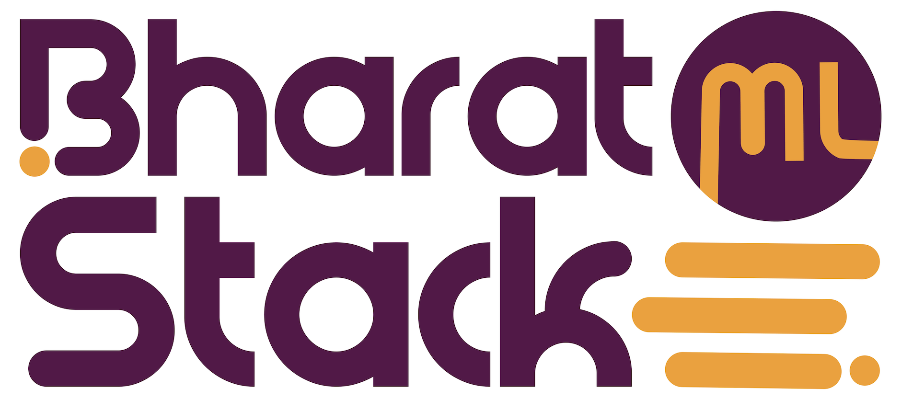
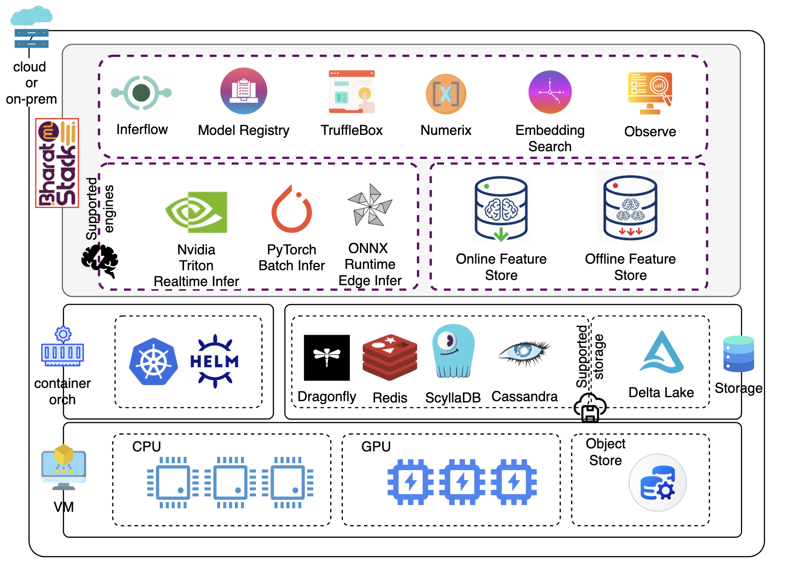

# BharatMLStack

<div align="center">
  
</div>


<div align="center">

[](https://github.com/Meesho/BharatMLStack/actions/workflows/ci.yml)

[](https://discord.gg/XkT7XsV2AU)
[](https://en.wikipedia.org/wiki/India)

[](https://meesho.com)


</div>

## What is BharatMLStack?

BharatMLStack is a production-ready, cloud-agnostic ML infrastructure platform that powers real-time feature serving, model inference, and embedding search at massive scale. Built and battle-tested at [Meesho](https://meesho.com), it is designed to help organizations ship ML to production faster, cheaper, and more reliably.

## Our Vision

BharatMLStack is built around **four core tenets**:

### Workflow Integration & Productivity
> Ship ML to production faster than ever.

- **3x faster** experiment-to-deployment cycles
- **95% reduction** in model onboarding time

### Cloud-Agnostic & Lock-In Free
> Run anywhere. Own your stack.

- Runs across **public cloud, on-prem, and edge**
- Kubernetes-native with zero vendor lock-in

### Economic Efficiency
> Do more with less.

- **60–70% lower** infrastructure costs vs hyperscaler managed services
- Optimized resource utilization across CPU and GPU workloads

### Availability & Scalability
> Enterprise-grade reliability at internet scale.

- **99.99% uptime** across clusters
- **1M+ QPS** with low latency

## Designed Truly for Bharat Scale

Built for the demands of one of the world's largest e-commerce platforms:

| Metric | Performance |
|--------|-------------|
| **Feature Store** | 2.4M QPS (batch of 100 id lookups) |
| **Model Inference** | 1M+ QPS |
| **Embedding Search** | 500K QPS |
| **Feature Retrieval Latency** | Sub-10ms |

## Documentation & Blogs

### Documentation
| Component | Link |
|-----------|------|
| Docs Home | [meesho.github.io/BharatMLStack](https://meesho.github.io/BharatMLStack/) |
| Online Feature Store | [Docs](https://meesho.github.io/BharatMLStack/category/online-feature-store) |
| Inferflow | [Docs](https://meesho.github.io/BharatMLStack/category/inferflow) |
| Skye | [Docs](https://meesho.github.io/BharatMLStack/category/skye) |
| Numerix | [Docs](https://meesho.github.io/BharatMLStack/category/numerix) |
| Go SDK | [Docs](https://meesho.github.io/BharatMLStack/category/go-sdk) |
| Python SDK | [Docs](https://meesho.github.io/BharatMLStack/category/python-sdk) |
| Quick Start | [Guide](https://meesho.github.io/BharatMLStack/category/quick-start) |

### Blogs
- [All Blog Posts](https://meesho.github.io/BharatMLStack/blog)

## Current Releases

| Component | Version |
|-----------|---------|
| **Horizon** (Control Plane) | `v1.3.0` |
| **TruffleBox UI** (ML Console) | `v1.3.0` |
| **Online Feature Store** | `v1.2.0` |
| **Go SDK** | `v1.2.0` |
| **Python SDK** | `v1.0.1` |
| **Numerix** (Compute Engine) | `v1.0.0` |
| **Inferflow** (Inference Orchestration) | `v1.0.0` |
| **Skye** (Embedding Search) | `v1.0.0` |

## Core Components

**Horizon** — Central control plane that orchestrates all BharatMLStack services and serves as the backend for TruffleBox UI.

**TruffleBox UI** — Web console for feature registry, cataloging, approval workflows, and feature store management.

**Online Feature Store** — High-performance feature store delivering sub-10ms retrieval at millions of QPS with streaming ingestion and backward-compatible versioning.

**Inferflow** — DAG-based real-time ML inference orchestration engine that chains feature retrieval, model execution, and post-processing into composable pipelines.

**Numerix** — Rust-powered mathematical compute engine for high-performance matrix operations over gRPC.

**Skye** — Vector similarity search platform for fast semantic retrieval with pluggable vector DB backends.

**Interaction Store** — ScyllaDB-backed system for storing and querying user interaction signals (clicks, orders, wishlist) with sub-10ms latency.

**Go SDK / Python SDK** — Client libraries for integrating with the Online Feature Store, Interaction Store, and inference logging.

## Quick Start

```bash
git clone https://github.com/Meesho/BharatMLStack.git
cd BharatMLStack/quick-start
ONFS_VERSION=v1.2.0 HORIZON_VERSION=v1.3.0 TRUFFLEBOX_VERSION=v1.3.0 NUMERIX_VERSION=v1.0.0 ./start.sh
```

For step-by-step setup, Docker Compose details, sample data, and health checks, see the full **[Quick Start Guide →](./quick-start/README.md)**.

## Architecture

<div align="center">
  
</div>

## Use-Cases

BharatMLStack powers a wide range of ML-driven applications:

| Use-Case | What BharatMLStack Enables |
|----------|---------------------------|
| **Personalized Candidate Generation** | Retrieve and rank millions of candidates in real time using feature vectors and embedding similarity |
| **Personalized Ranking** | Serve user, item, and context features at ultra-low latency to power real-time ranking models |
| **Fraud & Risk Detection** | Stream interaction signals and features to detect anomalies and fraudulent patterns in milliseconds |
| **Image Search** | Run embedding search at 500K QPS to match visual queries against massive product catalogs |
| **LLM Recommender Systems** | Orchestrate LLM inference pipelines with feature enrichment for next-gen recommendation engines |
| **DL & LLM Deployments at Scale** | Deploy and scale deep learning and large language models across GPU clusters with Inferflow orchestration |

## Contributing

We welcome contributions from the community! Please see our [Contributing Guide](CONTRIBUTING.md) for details on how to get started.

## Community & Support

- **Discord**: Join our [community chat](https://discord.gg/XkT7XsV2AU)
- **Issues**: Report bugs and request features on [GitHub Issues](https://github.com/Meesho/BharatMLStack/issues)
- **Email**: Contact us at [ml-oss@meesho.com](mailto:ml-oss@meesho.com)

## License

BharatMLStack is open-source software licensed under the [BharatMLStack Business Source License 1.1](LICENSE.md).

---

<div align="center">
  <strong>Built with ❤️ for the ML community from Meesho</strong>
</div>
<div align="center">
  <strong>If you find this useful, ⭐️ the repo — your support means the world to us!</strong>
</div>
