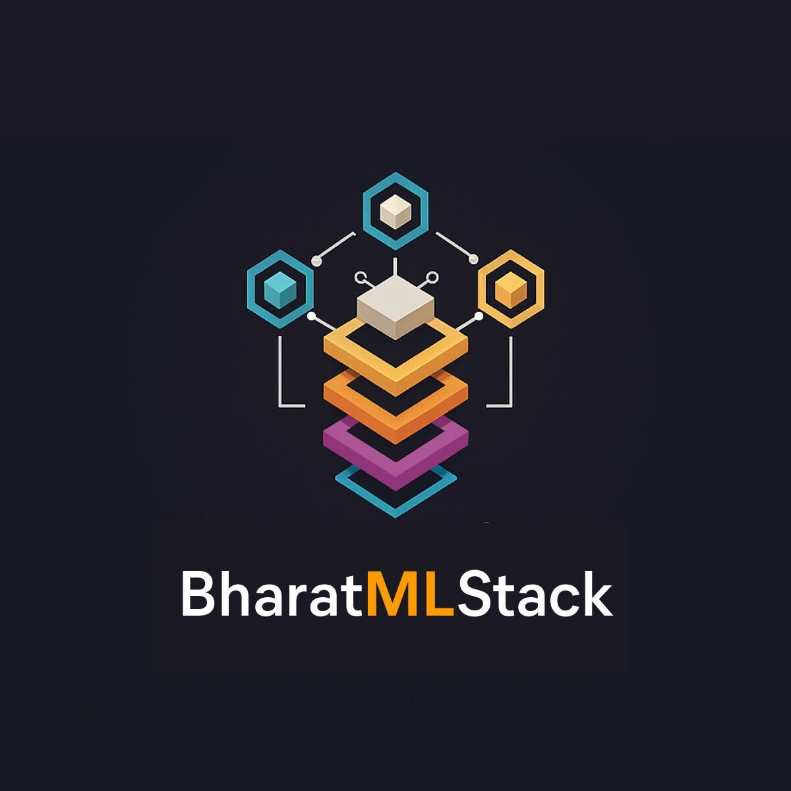

# BharatMLStack

<div align="center">
  
</div>


<div align="center">

[](https://github.com/Meesho/BharatMLStack/actions/workflows/ci.yml)

[](https://discord.gg/XkT7XsV2AU)
[](https://en.wikipedia.org/wiki/India)

[](https://meesho.com)


</div>

## What is BharatMLStack?

BharatMLStack is a comprehensive, production-ready machine learning infrastructure platform designed to democratize ML capabilities across India and beyond. Our mission is to provide a robust, scalable, and accessible ML stack that empowers organizations to build, deploy, and manage machine learning solutions at massive scale.

## Our Vision

- 🎯 **Democratize Machine Learning**: Make advanced ML infrastructure accessible to organizations of all sizes
- 🚀 **Scale Without Limits**: Built to handle millions of requests per second with enterprise-grade reliability
- 🇮🇳 **Bharat-First Approach**: Optimized for Indian market needs while maintaining global standards
- ⚡ **Real-Time Intelligence**: Enable instant decision-making with sub-millisecond feature serving
- 🔧 **Developer-Friendly**: Intuitive APIs and interfaces that accelerate ML development cycles

## Star History

[](https://www.star-history.com/#Meesho/BharatMLStack&Date)

## Running at Million Scale

BharatMLStack is battle-tested in production environments, powering:
- **1M+ feature vector retrievals per second** across distributed deployments
- **Sub-10ms latency** for real-time feature retrieval
- **99.99% uptime** with auto-scaling and fault tolerance
- **Petabyte-scale** feature storage and processing
- **Multi-region deployments** with global load balancing

## Document
- [Doc](https://meesho.github.io/BharatMLStack/)
- [Blogs](https://meesho.github.io/BharatMLStack/blog)
## Core Components

### 📋 Current Releases

| Component | Version | Description |
|-----------|---------|-------------|
| 🚀 **Horizon** | `v1.0.0` | Control Plane & Backend |
| 🎨 **Trufflebox UI** | `v1.0.0` | ML Management Console |
| 🗄️ **Online Feature Store** | `v1.0.0` | Real-Time Features |
| 🐹 **Go SDK** | `v1.0.0` | Go Client Library |
| 🐍 **Python SDK** | `v1.0.1` | Python Client Library |
| 🚀 **Numerix** | `v1.0.0` | Mathematical Compute Engine |

### 🚀 Horizon - Control Plane & Backend
The central control plane for BharatMLStack components, serving as the backend for Trufflebox UI.
- **Component orchestration**: Manages and coordinates all BharatMLStack services
- **API gateway**: Unified interface for all MLOps and workflows

### 🎨 Trufflebox UI - ML Management Console  
Modern web interface for managing ML models, features, and experiments. Currently it supports:
- **Feature Registry**: Centralized repository for feature definitions and metadata
- **Feature Cataloging**: Discovery and search capabilities for available features
- **Online Feature Store Control System**: Management interface for feature store operations
- **Approval Flows**: Workflow management for feature deployment and changes 

### 🗄️ Online Feature Store - Real-Time Features
High-performance feature store for real-time ML inference and training.
- **Real-time serving**: Sub-10ms feature retrieval at scale  
- **Streaming ingestion**: Process millions of feature updates per second
- **Feature Backward Compatible Versioning**: Track and manage feature evolution
- **Multi-source integration**: Push from stream, batch and real-time sources

### 🗄️ Numerix - Mathematical Compute Engine
High-performance feature store for real-time ML inference and training.
- **Matrix Operations**: High-performance matrix computations and transformations
- **gRPC API**: Fast binary protocol for efficient data transfer
- **Multi-format Support**: String and byte-based matrix formats
- **Optimized Performance**: Built with Rust for maximum efficiency
- **Scalable Architecture**: Designed for distributed processing

## Key Differentiators

- ✨ **Production-Ready**: Battle-tested components used in high-traffic production systems
- 🌐 **Cloud Agnostic**: Kubernetes-native, so deploy on the cloud you love
- 📊 **Observability**: Built-in monitoring, logging

## Quick Start

🚀 **Get started with BharatMLStack in minutes!**

For comprehensive setup instructions, examples, and deployment guides, see our detailed Quick Start documentation:

📖 **[Quick Start Guide →](./quick-start/README.md)**

### What You'll Find:

- **🐳 Docker Setup**: Complete stack deployment with Docker Compose
- **📊 Sample Data**: Pre-configured examples to get you started
- **🔍 Health Checks**: Verify your deployment is working
- **📝 Step-by-Step Tutorials**: From installation to first feature operations

### TL;DR - One Command Setup:

```bash
# Clone and start the complete stack
git clone https://github.com/Meesho/BharatMLStack.git
cd BharatMLStack/quick-start
ONFS_VERSION=<version> HORIZON_VERSION=<version> TRUFFLEBOX_VERSION=<version> NUMERIX_VERSION=<version> ./start.sh
```

Then follow the [Quick Start Guide](./quick-start/README.md) for detailed setup and usage instructions.

## Architecture

BharatMLStack follows a microservices architecture designed for scalability and maintainability. Several components are to be open-sourced

<div align="center">
  
</div>

### 🚀 Quick Navigation

| Component | Documentation | Quick Start |
|-----------|--------------|-------------|
| **Online Feature Store** | [Docs](https://meesho.github.io/BharatMLStack/category/online-feature-store) | [Setup](./quick-start/README.md) |
| **Go SDK** | [Docs](./go-sdk/README.md) | [Examples](./go-sdk/README.md) |
| **Python SDK** | [Docs](./py-sdk/README.md) | [Quickstart](./py-sdk/README.md) |
| **User Guide** | [Docs](https://meesho.github.io/BharatMLStack/trufflebox-ui/v1.0.0/userguide) | [Setup](./quick-start/README.md) |
| **Numerix** | [Docs](https://meesho.github.io/BharatMLStack/category/numerix) | [Setup](./quick-start/README.md) |

## Contributing

We welcome contributions from the community! Please see our [Contributing Guide](CONTRIBUTING.md) for details on how to get started.

## Community & Support

- 💬 **Discord**: Join our [community chat](https://discord.gg/XkT7XsV2AU)
- 🐛 **Issues**: Report bugs and request features on [GitHub Issues](https://github.com/Meesho/BharatMLStack/issues)
- 📧 **Email**: Contact us at [ml-oss@meesho.com](mailto:ml-oss@meesho.com )

## License

BharatMLStack is open-source software licensed under the [BharatMLStack Business Source License 1.1](LICENSE.md).

---

<div align="center">
  <strong>Built with ❤️ for the ML community from Meesho</strong>
</div>
<div align="center">
  <strong>If you find this useful, ⭐️ the repo — your support means the world to us!</strong>
</div>
