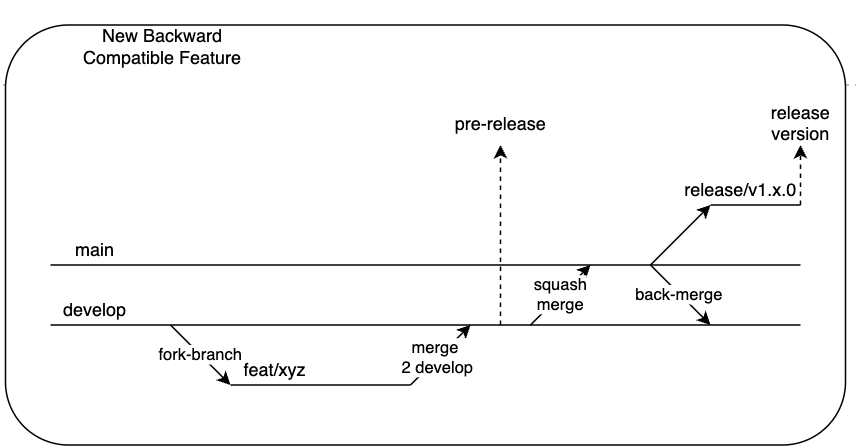
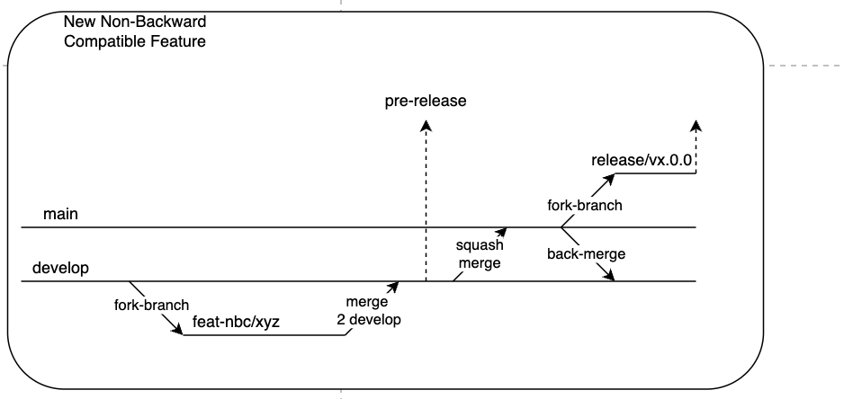
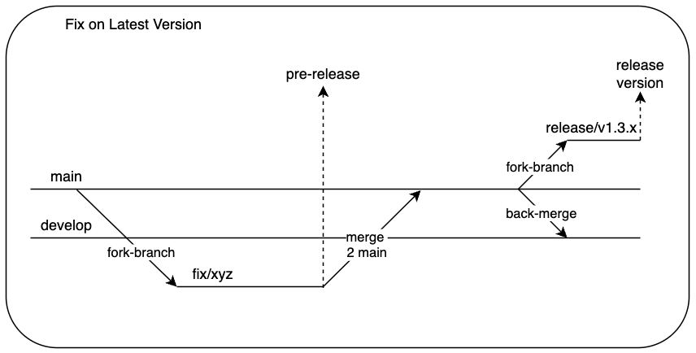

# Versioning and Release Strategy

This document outlines the versioning and release strategy for managing features and fixes in a structured and scalable manner.

## Digramatic Presentation

### New Backward Compatible Feature

### New Non-Backward Compatible Feature

### Fix on Latest Release

### Fix on Latest & Older Release Non Backward Compatible

## Branches

- **main**: Stable production branch.
- **develop**: Active development branch for integrating features and fixes before production release.
- **feature branches**: Created off `develop` or `main` depending on the use case.
- **release branches**: Cut from `main` for tagging releases.

---

## 1. New Backward-Compatible Feature

**Purpose**: Add new features that do not break existing functionality.

**Flow**:
1. Fork feature branch from `develop`
2. Work on `feat/xyz`
3. Merge (preferably squash) into `develop`
4. From `develop`, merge into `main`
5. Create a `release/v1.x.0` tag on `main`
6. Back-merge into `develop` (if required)
7. Pre-release optional at any point before final merge to `main`

---

## 2. New Non-Backward-Compatible Feature

**Purpose**: Introduce breaking changes.

**Flow**:
1. Fork feature branch from `develop`
2. Work on `feat-nbc/xyz`
3. Merge (squash) into `develop`
4. From `develop`, create a fork to `main`
5. Release version as `vx.0.0` from `main`
6. Back-merge changes into `develop`
7. Pre-release allowed before merging into `main`

---

## 3. Fix on Latest Version

**Purpose**: Apply hotfixes or patches to the latest release.

**Flow**:
1. Fork fix branch from `develop`
2. Work on `fix/xyz`
3. Merge into `main`
4. Release as `v1.3.x` (or relevant patch version)
5. Back-merge fix into `develop`
6. Pre-release optional

---

## 4. Fix Impacting Latest and Older Versions

**Purpose**: Apply fixes that are relevant to both latest and legacy versions.

**Flow**:
1. Fork fix branch from `develop`
2. Work on `fix/xyz`
3. Merge into `main`
4. Create new release branch (e.g., `release/v2.3.x`)
5. Back-merge into `develop`
6. Cherry-pick relevant fix commits to older release branch (e.g., `release/v1.8.5`)
7. Release both new (`v2.3.x`) and patched old (`v1.8.y`) versions
8. Pre-release at any point before final tagging

---

## Tagging Convention

- **vMAJOR.MINOR.PATCH** for regular releases.
- **vx.0.0** for breaking changes.
- **Pre-releases** should be tagged with `-alpha`, `-beta`, or `-rc` suffixes (e.g., `v1.2.0-beta.1`).

---

## Merge Strategy

- Use **squash merges** for feature/fix branches into `develop`.
- Use **regular merges** for integrating into `main`.
- Use **back-merges** from `main` into `develop` post-release to sync state.
- Use **cherry-picks** for applying selective fixes to older release branches.

---

## Summary Table

| Use Case                          | Base Branch | Merge Target | Release Format   | Notes                             |
|----------------------------------|-------------|---------------|------------------|-----------------------------------|
| Backward-Compatible Feature      | `develop`   | `main`        | `v1.x.0`         | squash merge, back-merge needed   |
| Non-Backward-Compatible Feature  | `develop`   | `main`        | `vx.0.0`         | new major release, fork first     |
| Latest Version Fix               | `develop`   | `main`        | `v1.x.y`         | bugfix, back-merge to develop     |
| Multi-Version Fix                | `develop`   | `main`, older | `v2.x.y`, `v1.x.y`| cherry-pick for older release     |
