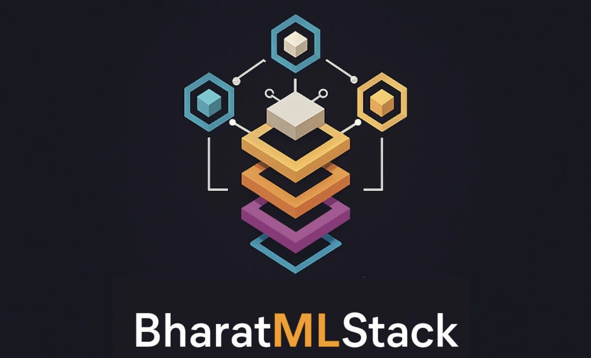
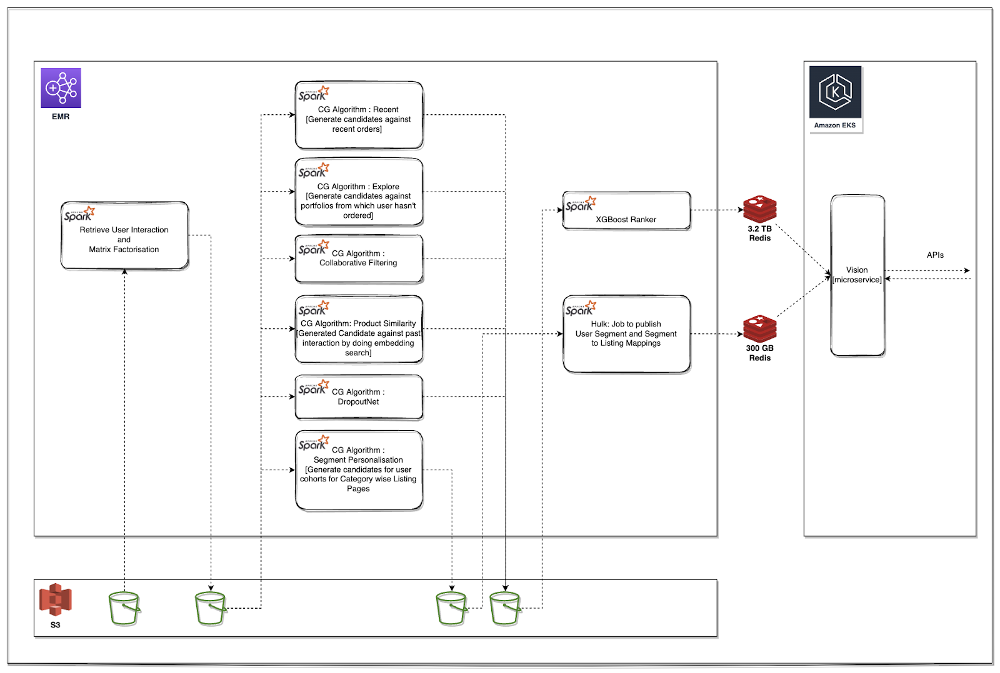
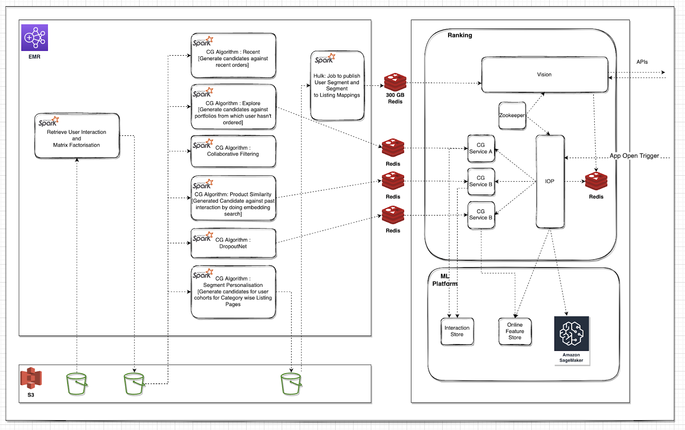
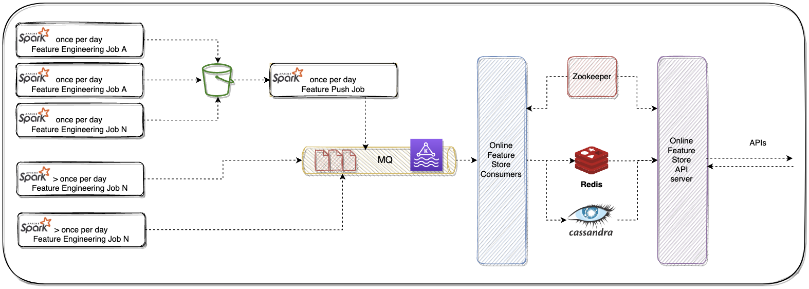
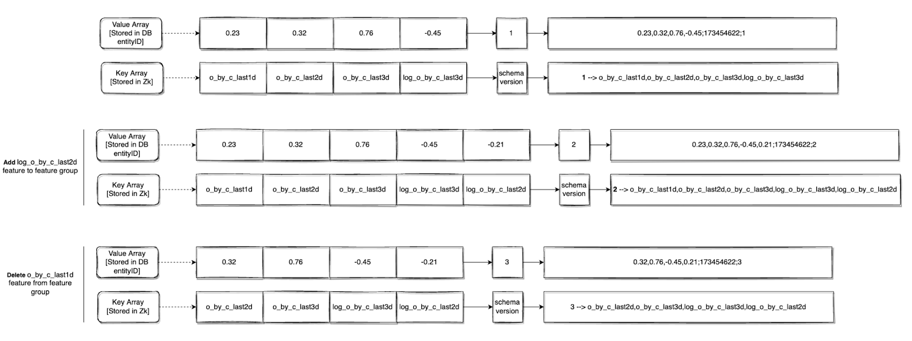
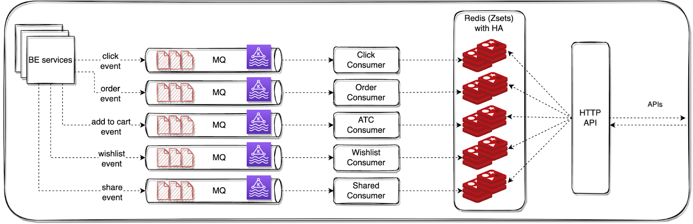

## The Genesis: How a Friday Night Roast Sparked Meesho’s ML Platform

It all started in early 2022, over a casual Friday evening catch-up. Like many great origin stories, this one began with friendly banter between a group of backend engineers and data scientists. As the conversations unfolded, so did the roasting—until one remark hit a little too close to home:

*"Why are we still crunching data for Monthly Active Users (MAU) when the next day it’s all about Daily Active Users (DAU)?"*

The laughter died down, and the question lingered. When we regrouped on Monday—clear-headed and slightly reflective—we decided to dig into the numbers. What they discovered was quite revealing: a large portion of compute resources wasn’t being put to good use.
Much of the system’s effort was spent supporting users who weren’t actively engaging, and even for new users, the experience wasn’t optimized to make a meaningful impact.

At the same time, Meesho had just launched a company-wide initiative to reduce costs—and every team had to contribute. This realization sparked the journey that would eventually lead to the **Meesho ML Platform**, known today as **BharatMLStack**.



Before the ML Platform, our recommendation and ranking pipelines followed a batch processing approach:
- **Data Ingestion**: The Data Platform team executed ETL jobs to ingest raw user data—including user profiles, interaction logs, and product impressions—into designated S3 buckets.
- **Layer 1**: Embedding Generation: On the Data Science side, Spark jobs pulled data from multiple S3 sources, cleaned and preprocessed it, and applied matrix factorization to generate user and item embeddings. The processed data and embeddings were then stored back in S3 in a structured format.
- **Layer 2**: Candidate Generation (CG): In this stage, Spark jobs leveraged embeddings and historical interaction data to generate candidate recommendations for users. These candidate lists were subsequently written to S3.
- **Layer 3**: Ranking and Merging – A final round of processing ranked the generated candidates using ML models, combined different candidate lists, and stored the final ranked recommendations in a caching system.
- **Serving**: A microservice retrieved ranked recommendations from an in-memory data store via exposed APIs, delivering personalized listings across key surfaces such as "For You" and Category Landing Pages (CLP).

This approach held up well—until Meesho started seeing a significant surge in traffic.

## The Turning Point: From Batch to Real-Time

At this time, the team was iterating on new **Ranker models**, and real-time inference seemed like the next logical step. But Rankers needed **real-time feature retrieval**, which meant an **online feature store** had to be built first.

Exploring open-source options led to **cost vs. performance trade-offs**, but Meesho’s surging traffic meant that **latency and stability were non-negotiable**. After multiple debates and stakeholder discussions, a bold decision was made:

*We would build our own feature store.*

Meanwhile, efforts began to bring **Candidate Generators (CGs)** to real-time. The challenge? **Storing and retrieving user interactions quickly enough** to power real-time recommendations.

As the team dove deeper, a new roadblock emerged:  
Our ML jobs were orchestrated using **Airflow DAGs**, giving data scientists flexibility in experimentation. But transitioning to real-time execution threatened this agility. Every change would now require backend engineering support, **slowing down iteration cycles**.

That’s when the idea struck:  
We needed a **framework for real-time DAG execution**—one that preserved the same flexibility as Airflow but worked for **streaming data**.

This moment shaped the **next phase of our journey**.

## First Generation Design



# Laying the Groundwork: The First-Gen ML Platform

To solve these challenges, the team built three foundational components:


### 1. IOP Framework: A Real-Time DAG Executor

- **Reusable Nodes**: Each DAG node (e.g., an invocation to a CG service, a ranker, or a filter) had to be implemented only once. After that, it could be reused across any workflow by referencing it in config.
- **Config-driven Dynamic Graphs**: Execution graphs were defined as adjacency lists stored in **ZooKeeper**, allowing teams to modify the sequence or structure of operations without touching application code.
- **Plug-and-play CGs**: The Candidate Generator interface was preserved, so a single CG node could call any CG service by passing `cg_name` in the request. This drastically reduced the code surface area and improved maintainability.
- **Production-Grade DAGs**: DAGs were designed to execute in **low-latency real-time environments**, with support for **parallel execution, retries, and branching**.

<u>[More about IOP DAG](https://www.meesho.io/blog/rebuilding-meeshos-ranking-platform)</u>


### 2. Online Feature Store - 0th Version

- Used **Cassandra** and **Redis** for low-latency feature serving.
- Maintained feature consistency using **Feature Groups** with TTL-based expiry.
- A hybrid schema was used: feature keys stored in **ZooKeeper**, data stored in **compact arrays**.


### 3. Interaction Store - 0th Version

- Captured real-time user interactions like clicks, orders, and add-to-cart events.
- Stored event data in **Redis ZSETs (sorted sets)** to enable fast lookups for recommendation engines.
- Provided an API to fetch a user's **last _k_ interactions** or **interactions within a time window**.


With these components in place, **real-time ML at Meesho became a reality**.

This was just the beginning.

## Building the Online Feature Store - 0th Version



### Choosing the Right Tech Stack

We spent considerable time evaluating various databases, caches, and communication protocols for our **online feature store**. After carefully weighing **cost, latency, throughput**, and **operational stability**, we settled on a combination of:

- **Cassandra** and **Redis** for storage
- **gRPC + Proto3** as our communication layer


### Streamlining the Data Flow

To keep things simple in the initial version:

- **Feature engineering jobs** wrote raw outputs to an **S3 bucket**
- A **daily feature push job**:
  - Read from S3
  - Grouped related features into **Feature Groups** (ensuring consistency)
  - Pushed them to **Kafka**

For features requiring frequent updates:

- **Ad-hoc jobs** computed features in higher frequency
- These jobs pushed to both **Kafka** and **S3**  (S3 preserved historical data for future model training)


## The Challenges: Data Format and Storage

One of the most critical design challenges was how to store feature data **efficiently and consistently**, especially in databases like **Cassandra** and **Redis**, which come with unique storage constraints.

We had to solve for three key requirements:

- ### Feature Consistency
  When a feature group contains features like `order_count_1h` and `click_count_1h`, both must reflect the **same time window**. Inconsistent updates would lead to **unreliable model predictions**.

- ### TTL Granularity
  Each feature group required an **expiry timestamp**, so that **all features within it expired together**—preserving consistency during reads.

- ### Extensibility Across Databases
  We anticipated that infra needs would evolve. To future-proof our system, the data format was designed to be **decoupled from DB-specific layouts**, enabling portability to systems like **ScyllaDB**, **DynamoDB**, **HBase**, or **BigTable**.


---

## Overcoming Technical Constraints
At the time, we were using Cassandra, which not only imposed a soft limit of 75 columns per row, but also exhibited significant performance degradation as the number of columns increased further, particularly in memory constrained machines. Wide rows caused high memory usage during reads, unpredictable latencies due to heavy deserialization overhead, and inefficiencies during compactions and repairs. This ruled out the naive "one column per feature" approach. We needed a format that was compact, minimized the number of columns, and remained efficient and portable across different storage systems.

## The Solution: Schema Separation

We introduced the concept of Feature Groups—logical groupings of features that must remain consistent with one another.
To represent these groups efficiently, we adopted a layered storage approach:

- **Feature Labels (Keys)** were stored in ZooKeeper, serving as the schema.
- **Feature Values** were stored as a comma-separated string array in Cassandra or Redis.
- **Expiry Timestamp and Schema Version** were appended using a semi-colon delimiter at the end of the string.

Example:

```bash
feature_1_value,feature_2_value,feature_3_value;expiry_ts
```

This format allowed:
- Consistent writes and reads at the group level
- Easy parsing of feature values using the schema lookup from ZooKeeper
- Efficient storage with minimal DB column usage
- Support for per-group TTLs and schema evolution

## Tracking Changes in Feature Groups
Feature groups don’t stay static. As models evolve, features get added, renamed, or removed. But schema changes often go live before the data is ready—and stopping ingestion just to wait for everything to align isn't feasible.

### Common Real-World Scenarios:
- A new feature is added to the schema, but ingestion jobs still use the older schema version.
- Ongoing writes don’t include the newly added feature, and stopping ingestion would break freshness for existing features.
- During serving, models request a mix of old and new features, depending on rollout stages.

## The Solution: Schema Versioning
We solved this with versioned feature group schemas, which unlocked several capabilities:
- ### Backward Compatibility
  Older ingestion jobs can continue writing using older schema versions. During reads, the system uses the schema version embedded in the value to interpret the data correctly.
- ### Partial Availability Handling 
  During inference, if some features in the request aren’t available (due to rollout delays or missing data), the system serves default values, ensuring the inference call doesn’t fail.
- ### Safe Writes Without Pipeline Pauses
   With schema versioning, we no longer had to stop ingestion pipelines for schema updates. Writes using previous versions can continue safely, and downstream consumers evolve independently.
This design gave us the flexibility to move fast without breaking things—preserving data quality, enabling experimentation, and ensuring reliability at scale.



## Interaction Store - 0th Version



To power real-time Candidate Generators (CGs), we needed fast access to user behavior signals—like what a user recently clicked, ordered, or added to their cart. These interactions form the basis for many real-time recommendations, such as **Similar Products**, **People Also Viewed**, or **Recently Ordered Again**.
For the **0th version** of the Interaction Store, we focused on a design that was **simple, fast, and reliable** — optimized for high-throughput ingestion and low-latency lookups.

## Event Ingestion
We instrumented our backend services to emit key user interaction events to Kafka in real time. These included:
- Click
- Order
- Add to Cart
- Wishlist
- Share

Each event carried essential metadata:
- userId — uniquely identifies the user
- productId — the item being interacted with
- timestamp — the moment the interaction occurred

This decoupled the interaction logging from storage, allowing ingestion and consumption to scale independently.

## Storage Design
To store these events, we built Kafka consumers that processed the incoming streams and wrote the data into Redis, using sorted sets (ZSETs) as the primary data structure.

### Why Redis?
Redis gave us:
- **Low-latency** reads and writes
- **Time-ordered data** using ZSETs (via score = timestamp)
- **Native TTL support**, if needed in later versions
- **In-memory performance** —ideal for real-time CGs

### Storage Structure
Each user’s interactions were stored using a composite key format, uniquely identifying the user and interaction type. This structure allowed efficient organization and quick retrieval of recent activity for recommendation generation:

```bash
userId_eventType → ZSET[...(pid, ts)...]
```

Within each ZSET:

- The **timestamp** served as the score, maintaining temporal order
- The **productId** (optionally with metadata) was the **value**

This allowed us to efficiently retrieve the interactions with HTTP-based API server with two query modes:
- Fetch the **last k interactions** of a specific type for a given user with  `ZREVRANGE(userId_eventType, count)`
- Retrieve **all interactions within a time range** (e.g., last 24 hours) with `ZREVRANGEBYSCORE(userId_eventType, timeRange)`

### Built-in Guardrails
Since Redis was the sole store, we implemented High Availability (HA) to prevent data loss. To optimize memory usage, we also enforced size limits per event type—only storing the last k interactions per user, with older entries getting truncated.

## Conclusion: Laying the Foundation for Real-Time ML

In this first phase, we tackled the **fundamentals**—shifting from batch-based recommendations to a **real-time Recommendation** using ML platform that could keep up with Meesho’s growth.

With the **IOP Framework**, **Online Feature Store**, and **Interaction Store**, we built the core infrastructure to support real-time personalization at scale. These wins have already unlocked: 
- ✅ Faster, more dynamic recommendations for millions of users. 
- ✅ Better infrastructure efficiency, reducing wasted compute power. 
- ✅ A flexible, modular system that allows for further experimentation.

But this is just the beginning. While we've solved key challenges, **certain roadblocks remain** —from optimizing **cost-performance trade-offs** to **seamlessly evolving schemas**.


This foundational work laid the path for a reliable and scalable **real-time feature serving layer**.