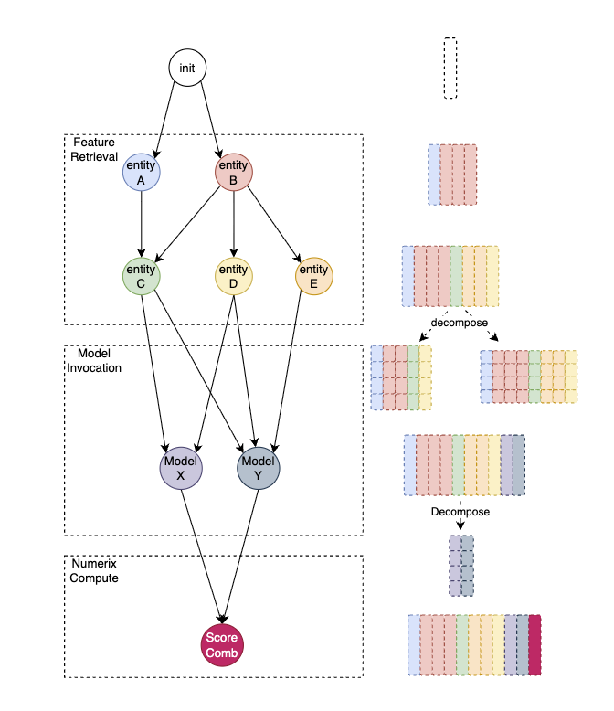

# BharatMLStack - Inferflow

Inferflow is part of **BharatMLStack**, a graph-driven feature retrieval and model inference orchestration engine built in **Go**. It eliminates the need for custom feature retrieval code by using configurable DAG topologies to dynamically resolve entity relationships, fetch features from the Online Feature Store, and orchestrate model scoring — all driven by configuration stored in **etcd**.

---

## Overview

In a typical ML serving pipeline, every new model requires bespoke code to:
- Fetch features from multiple entities (user, product, user x category, etc.)
- Infer intermediate entity relationships (e.g., extract category from product to fetch user x category data)
- Orchestrate one or more model inference calls
- Handle I/O, batching, and error propagation

Inferflow abstracts all of this behind a **config-driven DAG executor**. Given a `model_config_id` and context entities (e.g., `userId`, `productIds`), it:

1. Loads a pre-defined feature retrieval and inference graph from etcd
2. Executes the graph to resolve entity relationships dynamically
3. Retrieves features from the Online Feature Store (OnFS) in parallel
4. Calls model serving endpoints (Predator) and compute services (Numerix)
5. Returns scored results as a structured response

---

## High-Level Architecture


The diagram shows the internal DAG structure of Inferflow's topology executor. gRPC APIs (Pair, Point, Slate) feed into the DAG, where **Feature Init** bootstraps the ComponentMatrix. Feature components (FS User, FS Product, FS Region, FS User Cat, FS Region Scat) fetch features from **OnFS** in parallel and populate columns in the shared **2D Result Matrix**. Model components (Model A, Model B) call **Predator** for inference, and compute components call **Numerix** for operations like reranking. The entire DAG topology is driven by config loaded from **etcd**.

---

## Core Components

### 1. gRPC Server

Inferflow exposes its APIs via a gRPC server, with HTTP health endpoints multiplexed on the same port using **cmux**. The server provides:

- **Inferflow API** — `RetrieveModelScore`: entity-based feature retrieval and scoring
- **Predict API** — `InferPointWise`, `InferPairWise`, `InferSlateWise`: structured inference with targets, pairs, and slates

### 2. DAG Topology Executor

The heart of Inferflow. Each model configuration defines a `component_dependency` map that describes a Directed Acyclic Graph (DAG) of components.

**Execution model:**
- Uses **Kahn's algorithm** for topological ordering
- Components at the same level run **concurrently** in goroutines
- All components share a mutable `ComponentMatrix` (rows = entity IDs, columns = features/scores)
- DAG topologies are **cached** using Murmur3 hashing with Ristretto cache

**Validation:**
- Cycle detection via in-degree analysis
- Component existence verification against the `ComponentProvider`

### 3. Component Types

Inferflow defines four types of DAG components:

| Component | Role | External Dependency |
|-----------|------|---------------------|
| **FeatureInitComponent** | Root node — initializes the `ComponentMatrix` with entity IDs and schema | None |
| **FeatureComponent** | Fetches features from the Online Feature Store for a specific entity type | OnFS (gRPC) |
| **PredatorComponent** | Calls model serving endpoints for inference scoring | Predator / Helix (gRPC) |
| **NumerixComponent** | Calls compute engine for operations like reranking | Numerix (gRPC) |

### 4. ComponentMatrix — The 2D Result Matrix

The ComponentMatrix is a shared, mutable 2D data structure that flows through the entire DAG. Every component reads from and writes to this matrix, progressively building a complete feature + score row for each entity.



#### How the matrix evolves through the DAG

The diagram above illustrates the three execution phases and how the 2D matrix grows at each stage:

**Phase 1 — Feature Retrieval**

The **init** node creates an empty matrix with one row per target entity ID. Feature components then execute — first the top-level entities (entity A, entity B) fetch their features from OnFS and populate their columns (shown as colored blocks). Derived entities (entity C, D, E) resolve their keys from the already-populated columns and add more feature columns. At this point the matrix contains all feature data, with each color representing features from a different entity.

The right side of the diagram shows the matrix being **decomposed** — feature columns from different entities are separated into per-model input groups, selecting only the features each model needs.

**Phase 2 — Model Invocation**

Model X and Model Y each receive their decomposed feature slices, call **Predator** for inference, and write score columns back into the matrix (shown as new colored columns appended to the right). Multiple models can run in parallel if they don't depend on each other's outputs.

The scores are then decomposed again to prepare inputs for the compute stage.

**Phase 3 — Numerix Compute**

The **Score Comb** node takes score columns from both models, calls **Numerix** for a final compute operation (e.g., score combination, reranking), and writes the final score column (shown in dark red) into the matrix. The result is a complete row per entity with all features and all scores.

#### Matrix structure

| Property | Description |
|----------|-------------|
| **Rows** | One per target entity ID (e.g., each product being scored) |
| **String columns** | Human-readable values used in responses |
| **Byte columns** | Binary-encoded feature values used for model inputs |
| **Column naming** | `entity_label:feature_group:feature_name` |

Each component only reads the columns it needs and writes to its own columns, enabling safe concurrent execution across independent branches of the DAG.

For slate-based APIs, a companion `SlateData` structure holds per-slate matrices and scores, with `slate_target_indices` mapping slates to rows in the main matrix.

### 5. Configuration Management (etcd)

Model configurations are stored in etcd and hot-reloaded via watchers:

- **Config paths**: `/config/inferflow/services/`, `/model-config`
- **Watch mechanism**: etcd watchers trigger `ReloadModelConfigMapAndRegisterComponents` on any change
- **On reload**: Updates `ConfigMap`, re-initializes feature schemas, and re-registers DAG components

This means new models or configuration changes go live **without redeployment**.

### 6. External Integrations

#### Online Feature Store (OnFS)
- gRPC client calling `FeatureService.RetrieveFeatures`
- Batched retrieval with configurable batch size and deadline
- Auth via `CALLER_ID` and `CALLER_TOKEN` metadata

#### Predator (Model Serving)
- Uses `go-sdk` for model inference
- Supports **percentage-based traffic routing** across multiple model endpoints
- Configurable calibration and batch sizing

#### Numerix (Compute Engine)
- Uses `go-sdk` Numerix client
- RPC: `NumerixService.Compute` with entity score data
- Used for compute operations like reranking

#### Kafka (Inference Logging)
- Async inference log publishing using `segmentio/kafka-go`
- Supports **Proto**, **Arrow**, and **Parquet** serialization formats
- Configurable sampling via `LoggingPerc` and user-based daily sampling

---

## Request Flow

```
1. Client sends gRPC request with model_config_id + entity IDs
                    │
2. Load ModelConfig from etcd-backed ConfigMap
                    │
3. Adapt proto request → ComponentRequest
   (build ComponentMatrix with entity schema)
                    │
4. Resolve DAG topology from component_dependency config
                    │
5. Execute DAG (Kahn's algorithm, concurrent):
   │
   ├─ FeatureInitComponent: populate matrix with entity IDs + schema
   │
   ├─ FeatureComponents (parallel): fetch features from OnFS → fill matrix columns
   │
   ├─ PredatorComponent: build feature payloads from matrix → call model → write scores
   │
   └─ NumerixComponent: read scores from matrix → call compute → write final scores
                    │
6. Build response from matrix columns per ResponseConfig
                    │
7. (Optional) Async Kafka logging of inference features and scores
                    │
8. Return gRPC response to client
```

---

## Observability

### Metrics (StatsD / Telegraf)

| Metric | Description |
|--------|-------------|
| `inferflow.retrievemodelscore.request.total` | Total RetrieveModelScore requests |
| `inferflow.retrievemodelscore.latency` | End-to-end latency |
| `inferflow.retrievemodelscore.batch.size` | Batch size per request |
| `predict.infer.request.total` | Total Predict API requests |
| `predict.infer.latency` | Predict API latency |
| `inferflow.component.execution.total` | Per-component execution count |
| `inferflow.component.execution.latency` | Per-component latency |
| `inferflow.component.execution.error` | Component-level errors |
| `inferflow.component.feature.count` | Feature count per component |
| `inferflow.external.api.request.total` | External API call count |
| `inferflow.external.api.latency` | External API latency |
| `inferflow.component.inmemorycache.request.total` | Cache hit/miss total |
| `inferflow.component.inmemorycache.miss` | Cache misses |
| `inferflow.logging.kafka_sent` | Kafka log messages sent |

### Logging
- Structured JSON logging via **zerolog**
- Configurable log levels

---

## Deployment

### Docker

Inferflow ships as a multi-stage Docker image:

- **Builder**: Go 1.19 Alpine with optional Kafka support (librdkafka)
- **Runtime**: Debian 10 slim
- **Build command**: `go build -tags musl -ldflags "-extldflags -static" -o server cmd/${module}/main.go`

### Supported Environments
- Kubernetes (K8s)
- Google Kubernetes Engine (GKE)
- Amazon EKS

### Configuration
All configuration is driven via environment variables (loaded by Viper) and etcd. No config files are required at deployment time.

---

## Target Users

| User | Role |
|------|------|
| Data Scientists | Define model configs and feature retrieval graphs via config — no code needed |
| ML Engineers | Onboard new models by updating etcd config; manage DAG topologies |
| Backend Developers | Integrate via gRPC SDKs for real-time scoring in application services |
| Platform Engineers | Deploy, scale, and monitor Inferflow clusters |

---

## Benefits

- **No-code feature retrieval** — new models need only a config change, not custom code
- **Feature consistency** — same graph-driven retrieval ensures identical features across experiments
- **Faster iteration** — experiment with new models in minutes, not days
- **Concurrent execution** — DAG components run in parallel for minimal latency
- **Hot reloading** — model config changes via etcd go live without redeployment
- **Multi-API support** — PointWise, PairWise, and SlateWise inference patterns out of the box
- **Production-grade** — built in Go with gRPC, designed for millions of QPS

---

## Contributing

We welcome contributions from the community! Please see our [Contributing Guide](https://github.com/Meesho/BharatMLStack/blob/main/CONTRIBUTING.md) for details on how to get started.

## Community & Support

- **Discord**: Join our [community chat](https://discord.gg/XkT7XsV2AU)
- **Issues**: Report bugs and request features on [GitHub Issues](https://github.com/Meesho/BharatMLStack/issues)
- **Email**: Contact us at [ml-oss@meesho.com](mailto:ml-oss@meesho.com)

## License

BharatMLStack is open-source software licensed under the [BharatMLStack Business Source License 1.1](https://github.com/Meesho/BharatMLStack/blob/main/LICENSE.md).

---

<div align="center">
  <strong>Built with ❤️ for the ML community from Meesho</strong>
</div>
<div align="center">
  <strong>If you find this useful, ⭐️ the repo — your support means the world to us!</strong>
</div>
