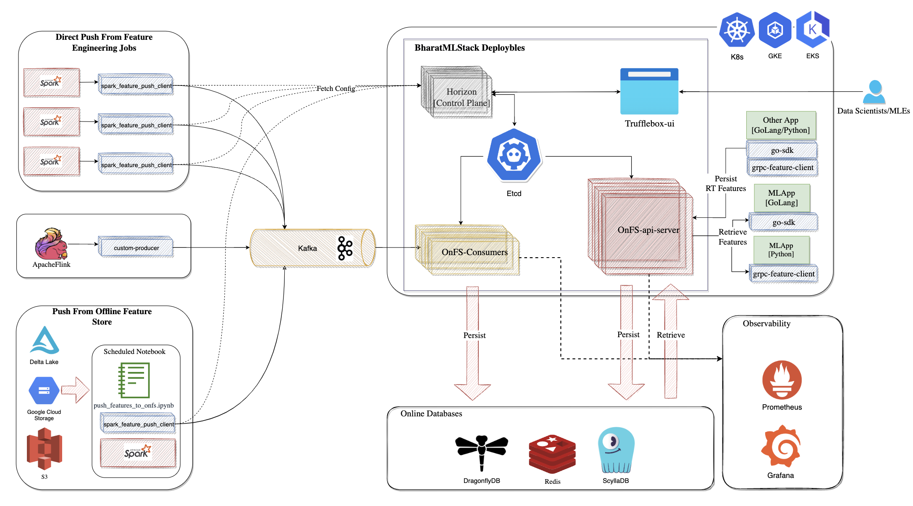

# BharatMLStack - Online Feature Store (OnFS)

The Online Feature Store (OnFS) is part of **BharatMLStack**, designed to support real-time ML workloads through low-latency feature retrieval and flexible feature ingestion pipelines. It ensures that features generated offline or online are immediately accessible for inference.

---

## 🧩 Key Components

### 1. **Data Ingestion Paths**
#### a. **Direct Push from Feature Engineering Jobs**
- **Source:** Apache Spark
- **Client:** `spark_feature_push_client`
- **Flow:** Features are pushed directly to Kafka.

#### b. **Push from Offline Feature Store**
- **Source:** Delta Lake, GCS, or S3
- **Flow:** Scheduled notebooks (`push_features_to_online-feature-stores.ipynb`) push to Kafka using the same `spark_feature_push_client`.

#### c. **Streaming Push via Apache Flink**
- **Source:** Flink streaming jobs
- **Client:** `custom-producer`
- **Flow:** Real-time features sent to Kafka.

---

### 2. **Message Queue: Kafka**
Kafka serves as a decoupled buffer between producers (push clients) and consumers (OnFS ingestion workers), ensuring durability and backpressure handling.

---

### 3. **Core Components**

#### 🧠 **Horizon Control Plane**
- Manages config distribution and metadata orchestration.
- Stores schemas, feature group mappings, job configurations in `etcd`.

#### 🔍 **Trufflebox UI**
Frontend interface for managing the ML Feature Store ecosystem:
- **Feature Catalog** – Browse, search, and inspect registered features and groups.
- **Store and Job Registry** – View and manage ingestion jobs, feature store states, and lineage.
- **Admin Ops** – Approve or reject feature group pushes and schema edits.
- Designed for use by **Data Scientists, MLEs**, and **Platform Admins**.

#### ⚙️ **OnFS-Consumers**
- Kafka consumers that read and validate feature messages.
- Responsible for persisting features to online databases (Redis, ScyllaDB, DragonflyDB).

#### 🚀 **OnFS API Server**
- gRPC server exposing interfaces for:
  - Real-time feature persistence.
  - Low-latency feature retrieval.
- Access controlled and schema-validated via `etcd`.

---

### 4. **Online Databases**
Stores real-time features for high-performance retrieval:
- **DragonflyDB**
- **Redis**
- **ScyllaDB**

---

### 5. **Clients for Serving**
Applications use client SDKs to fetch features:
- **Go SDK**: `go-sdk`
- **Python SDK**: `grpc-feature-client`
- Used in backend inference apps to request features using entity keys.

---

### 6. **Observability**
- **Prometheus** – Metrics collection (e.g., ingest lag, QPS, latency).
- **Grafana** – Dashboard for platform health, feature access, ingestion success/failure.

---

## 💻 Supported Environments
- Kubernetes (K8s)
- Google Kubernetes Engine (GKE)
- Amazon EKS

---

## 👥 Target Users

| User            | Role                                                                      |
|-----------------|---------------------------------------------------------------------------|
| Data Scientists | Browse features, define jobs, approve/reject changes via Trufflebox UI    |
| MLEs            | Develop and push features using Spark/Flink/notebooks                     |
| Infra Admins    | Manage store lifecycle, metadata, and approvals                           |
| Backend Devs    | Use SDKs to retrieve features in Go/Python inference services             |

---

## ✅ Benefits
- Unified real-time and offline ingestion.
- Low-latency inference-ready features.
- Config-driven orchestration.
- Built-in approval workflows via Trufflebox.
- Scalable across thousands of entities and feature groups.

## Contributing

We welcome contributions from the community! Please see our [Contributing Guide](https://github.com/Meesho/BharatMLStack/blob/main/CONTRIBUTING.md) for details on how to get started.

## Community & Support

- 💬 **Discord**: Join our [community chat](https://discord.gg/XkT7XsV2AU)
- 🐛 **Issues**: Report bugs and request features on [GitHub Issues](https://github.com/Meesho/BharatMLStack/issues)
- 📧 **Email**: Contact us at [ml-oss@meesho.com](mailto:ml-oss@meesho.com )

## License

BharatMLStack is open-source software licensed under the [BharatMLStack Business Source License 1.1](https://github.com/Meesho/BharatMLStack/blob/main/LICENSE.md).

---

  <strong>Built with ❤️ for the ML community from Meesho</strong>

  <strong>If you find this useful, ⭐️ the repo — your support means the world to us!</strong>

