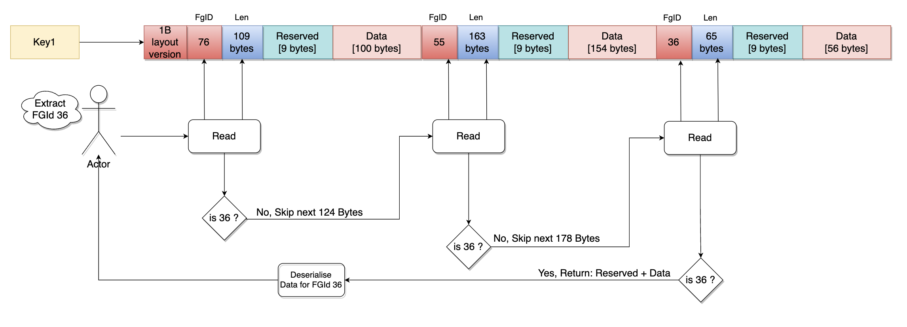

# Data Format for Permanent & Cache Storage

In this section we will go through the data-formats which is at the hear of online-feature-store, it's inspired form other storage efficient formats like parquet & arrow, but custom made to deliver in constraint environment. The two key data-formats are:
- **PSDB** - Permanent Storage Data Block used wile storing data in ScyllaDB
- **CSDB** - Cache Storage Data Block used while storing data in DragonflyDB or Redis, optimal for KV
- 

## PSDB (Permanent Storage Data Block) Format

The **PSDB** format is a compact, versioned, and schema-aware binary layout used to store feature groups efficiently for ML inference. It supports multiple datatypes (strings, booleans, fixed-size vectors), versioning, TTL, and metadata encoding in a compact header.

---

### 🧱 Structure Overview

Each PSDB block is composed of multiple byte sections:


| Byte | Bits        | Field                  | Description                                                                 |
|------|-------------|------------------------|-----------------------------------------------------------------------------|
| 0-1  | 0-15        | Feature Schema Version | Version for tracking schema changes (additions/deletions) in feature group |
| 2-6  | 16-55       | Expiry Timestamp       | Encoded as a compact representation, ~513 days max | infinite                                       |
| 7    | 56-59       | Layout Version         | Used to ensure backward compatibility with layout format changes           |
| 7    | 60-62       | Compression Type       | 3-bit field specifying compression algorithm                               |
| 7-8  | 63-67       | Data Type              | 5-bit field split across bytes 7 and 8                                     |
| 8    | 68-71       | Bool Last Valid Bit    | 4-bit field for last valid boolean bit                                     |

---

### Supported Data Types

#### Scalar Types

| Type | Container | Size | Description |
|------|-----------|------|-------------|
| `FP32`, `FP16`, `FP8E4M3`, `FP8E5M2` | `[]float32` | 4/2/1/1 bytes | Floating point numbers |
| `Int32`, `Int16`, `Int8` | `[]int32` | 4/2/1 bytes | Signed integers |
| `Uint32`, `Uint16`, `Uint8` | `[]uint32` | 4/2/1 bytes | Unsigned integers |
| `FP64` | `[]float64` | 8 bytes | Double precision float |
| `Int64` | `[]int64` | 8 bytes | 64-bit signed integer |
| `Uint64` | `[]uint64` | 8 bytes | 64-bit unsigned integer |
| `String` | `[]string` | Variable | Pascal-style strings |
| `Bool` | `[]uint8` | Bit-packed | Boolean values |

#### Vector Types

| Type | Container | Description |
|------|-----------|-------------|
| `FP32Vector`, `FP16Vector`, etc. | `[][]float32` | 2D slices of floating point |
| `Int32Vector`, `Int16Vector`, etc. | `[][]int32` | 2D slices of signed integers |
| `Uint32Vector`, `Uint16Vector`, etc. | `[][]uint32` | 2D slices of unsigned integers |
| `FP64Vector` | `[][]float64` | 2D slices of doubles |
| `Int64Vector` | `[][]int64` | 2D slices of 64-bit signed |
| `Uint64Vector` | `[][]uint64` | 2D slices of 64-bit unsigned |
| `StringVector` | `[][]string` | 2D slices of strings |
| `BoolVector` | `[][]uint8` | 2D slices of bit-packed bools |

### 📦 Encoding for Scalar Feature Type

#### 1. 🔡 String Feature Group (Variable Length Encoding using Pascal)
- Max string length: **65536**
- Format:

- Deserialization:
  - Read length prefixes
  - Extract string bytes using `StrLenX`

#### 2. 🟩 Boolean Feature Group (Bit-Packed)
- Saves space using bit-level packing.
- Encoding:
  - Raw: 1 byte per feature
  - Bit-packed: 1 bit per boolean
  - Additional index (`bool last idx`) stores where the last bit resides
- Format:


#### 3. 📏 Fixed-Length Feature Group
- For fixed-size vectors (`n` bytes each)
- Format:

- Efficient for dense numeric features like float32, int64, etc.

#### 4. Compression

- `TypeNone (0)`: Raw storage
- `TypeZSTD (1)`: Compressed using Zstandard

Compression is opportunistic. During serialization, if compressed size is not smaller, PSDB falls back to uncompressed format. It keeps the read/high througput path use less CPU cycles. Also only data part of PSDB is compressed allowing decompression only if block has a valid TTL


---

### 🧬 Encoding for Vector Types

#### Conceptual Overview
PSDB encodes vector data by flattening multi-dimensional arrays into a single contiguous byte buffer while preserving the ability to reconstruct the original vector boundaries.

#### Vector Length Metadata
Each feature group maintains metadata about vector dimensions in the Feature Registry. For example, if a feature group has:
```yaml
fg1:
  version-2:
    features:
      f1: { vector_len: 6, default: [bytes] }
      f2: { vector_len: 3, default: [bytes] }
  version-1:
    features:
      f1: { vector_len: 6, default: [bytes] }
```
- Feature f1 with vector_len: 6
- Feature f2 with vector_len: 3
- 
This means:
- `f1` contains vectors of exactly 6 elements each
- `f2` contains vectors of exactly 3 elements each

#### Encoding Process
##### **Input Structure**
The serializer receives vector data as 2D slices where:
  - Outer dimension represents different feature instances/entities
  - Inner dimension represents the vector elements for each instance

##### **Length Validation**
Before encoding, PSDB validates that each vector's actual length matches the declared vector_len from the feature metadata. This ensures data integrity and enables efficient decoding.

##### **Flattening Strategy**
Vectors are serialized in row-major order (also called C-style order):
- All elements of the first vector are written consecutively
- Followed by all elements of the second vector
- And so on...
 
##### **Contiguous Layout**
The resulting byte buffer contains all vector elements placed end-to-end without gaps or separators. The decoder can reconstruct vector boundaries because it knows:
- The data type size (e.g., 4 bytes for float32), from feature registry
- The vector length for each position, from feature registry
- The total number of vectors, from feature registry
- In case of `variable length` length is encoded into the data, like for `String` data-type


---

### 🔄 Deserialization/Decoding Flow

1. **Extract version** from first 2 bytes.
2. **Look up schema** from etcd using the version.
3. **Determine feature shapes** (e.g., vector lengths).
4. **Slice and decode** data from byte buffer accordingly.

---

### Memory Efficiency Benefits
- **No Padding**: Elements are packed tightly without alignment padding
- **No Delimiters**: Vector boundaries are implicit, not stored explicitly
- **Cache Friendly**: Sequential memory access patterns during encoding/decoding
- **Minimal Metadata**: Only vector lengths are stored separately, not per-element


---

---

## Cache Storage Data Block (CSDB) Design

### Overview
The Cache Storage Data Block (CSDB) is a compact binary data format that encapsulates serialized data blocks for multiple feature groups. It is designed to support both in-memory and distributed caching of deserialized PSDB (Permanent Storage Data Block) content, optimizing for speed, deduplication, and minimal memory overhead.

### Structure and Purpose
Each CSDB contains a mapping of feature group IDs (FG IDs) to deserialized PSDBs. For distributed systems, this structure is flattened into a serialized byte slice. The CSDB supports layout versioning for backward compatibility and negative caching for feature groups with no associated data.

#### Core Fields and Memory Layout
```go
type CacheStorageDataBlock struct {
    // 8-byte aligned map pointer
    FGIdToDDB map[int]*DeserializedPSDB // offset: 0

    // 24-byte slice (ptr, len, cap)
    serializedCSDB []byte // offset: 8

    // 4-byte fields
    TTL uint32 // offset: 32

    // 1-byte fields
    layoutVersion uint8     // offset: 36
    cacheType     CacheType // offset: 37
    // 2 bytes padding to maintain 4-byte alignment
}
```
The structure is memory-aligned for optimal performance:
- Pointers and slices are 8-byte aligned
- Smaller fields (like `uint8`) are grouped and padded to avoid false sharing
- This layout ensures efficient use of CPU caches during access

#### Cache Types
- **In-Memory Cache**: Uses the `FGIdToDDB` map directly and avoids serialization unless explicitly requested.
- **Distributed Cache**: Stores a serialized binary format in `serializedCSDB`, which is deserialized lazily when required.

### Format & Encoding

**CSDB Binary Layout**: Serialized CSDBs follow this compact format:

```
[LayoutVersion (1 byte)][FGID (2 bytes)][DataLen (2 bytes)][Data ...]   → repeated per feature group
```
- FGID and DataLen are encoded as `uint16`
- If `DataLen == 0`, it denotes a negative cache (no data available for that FG)
- The data section contains the PSDB header and either compressed or uncompressed data

This layout allows fast scanning and partial deserialization for selected FG IDs, making it optimal for large-scale caching systems.

### Differences Between In-Memory and Distributed Caching

| Aspect            | In-Memory CSDB                          | Distributed CSDB                          |
|------------------|-----------------------------------------|-------------------------------------------|
| Storage Format   | Live Go objects (map[int]*DeserializedPSDB) | Serialized byte buffer (`[]byte`)        |
| Deserialization  | Performed on-demand using offset map    | Performed on-demand using offset map      |
| Compression      | Optional during serialization           | Typically enabled to reduce payload size  |
| Usage Pattern    | Fast lookup in active process memory    | Cross-node cache sharing and persistence  |
| Memory Overhead  | Higher (due to live objects)            | Lower (compact representation)            |

### Optimizations & Features

- **Partial FG ID Fetch**: When only a subset of FG IDs is needed, CSDB avoids unnecessary deserialization of other IDs.
- **Negative Caching**: FG IDs with no data are encoded with `DataLen=0`, saving space and avoiding repeated lookups.
- **Offset-Length Map**: During deserialization, FGID to offset+length pairs are cached internally for efficient random access.
- **Versioning Support**: Layout version is stored as the first byte to enable format upgrades while maintaining backward compatibility.

Diagram below explains how compute cycles are saved by partial de-compression. 




