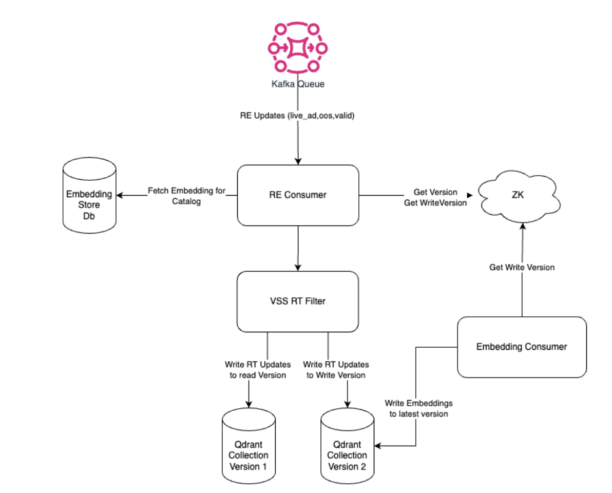

# Skye - Vector Similarity Search Platform

Skye is BharatMLStack's vector similarity search platform that enables fast semantic retrieval by representing data as vectors and querying nearest matches in high-dimensional space. It is composed of three runnable components: **skye-admin**, **skye-consumers**, and **skye-serving**.

---

## System Overview


Skye provides a critical platform for managing data aggregation, model onboarding, and embedding support at production scale. The architecture is designed around three core pillars:

- **Pluggable Vector Databases**: Support for multiple vector database backends (Qdrant and extensible to others) via a generic abstraction layer.
- **Tenant-Level Index Isolation with Shared Embeddings**: Models are stored once but can serve multiple tenants (variants), reducing data redundancy.
- **Event-Driven Administration**: Model lifecycle management is handled through Kafka-based event flows for resilience and fault tolerance.

### Component Architecture

| Component | Role |
|---|---|
| **skye-serving** | Handles real-time similarity search queries with in-memory caching and vector DB lookups |
| **skye-consumers** | Processes embedding ingestion (reset/delta jobs) and real-time aggregation events from Kafka |
| **skye-admin** | Manages model lifecycle, onboarding, variant registration, and coordinates Databricks jobs |

---

## Data Model

### Model and Variant Hierarchy

Skye uses a **model-first** hierarchy rather than a tenant-first approach. Models sit at the base level with variants (formerly tenants) nested within each model. This eliminates embedding duplication across tenants.

```
model (e.g., intent_model)
  ├── model_config (distance_function, vector_dimension, etc.)
  ├── embedding_store (shared embeddings for all variants)
  ├── variant_1 (e.g., organic)
  │   ├── vss_filter (criteria for index inclusion)
  │   ├── vectordb_type (QDRANT, etc.)
  │   ├── vectordb_config (host, port, replication, sharding)
  │   ├── read_version / write_version
  │   └── job_frequency (FREQ_1D, FREQ_3H, etc.)
  └── variant_2 (e.g., ad)
      ├── vss_filter
      ├── vectordb_type
      └── ...
```

**Key benefit**: If a model consumes 30M embeddings and is used by two variants, the embeddings are stored once (30M) instead of duplicated (60M).

### Entity-Based Data Split

Data is split at the entity level (catalog, product, user) into separate tables for both embeddings and aggregator data:

**Embedding Tables** (per entity):

```sql
CREATE TABLE catalog_embeddings (
    model_name text,
    version int,
    id text,
    embedding frozen<list<decimal>>,
    search_embedding frozen<list<decimal>>,
    to_be_indexed_variant_1 boolean,
    to_be_indexed_variant_2 boolean,
    PRIMARY KEY ((model_name, version), id)
);
```

**Aggregator Tables** (per entity):

```sql
CREATE TABLE catalog_aggregator (
    id text,
    is_live_ad text,
    out_of_stock text,
    PRIMARY KEY (id)
);
```

Each entity is mapped via a store configuration:

```json
{
    "db_conf_id": "1",
    "embeddings_table": "catalog_embeddings",
    "aggregator_table": "catalog_aggregator"
}
```

---

## Serving Flow

The serving path is optimized for low latency with multiple caching layers:

1. **Request arrives** at skye-serving via gRPC
2. **ConfigRepo** resolves the model configuration, variant filters, and vector DB connection
3. **In-memory cache** is checked first to reduce load on distributed cache
4. **Distributed cache (Redis)** is checked next for cached similarity results
5. **Vector DB query** executes if cache misses, using `search_indexed_only` flag for optimal searches within indexed space
6. **Aggregator data** is fetched from ScyllaDB to apply variant-level filters
7. **Response** returns ranked similar candidates with scores

### Configuration Bootstrap

On startup, ConfigRepo creates:
- A map of each model with its configurations (embedding table, vector DB channel)
- A map of each entity to its aggregator table

```json
{
    "intent_model": {
        "db_conf_id": "1",
        "index_embedding_table": "catalog_embeddings",
        "vector_db_grpc_channel": "<grpc_channel_info>"
    }
}
```

---

## Admin Flows

Skye uses an **event-driven approach** for model lifecycle management:

- All admin operations are processed through Kafka consumers asynchronously
- A SQL database behind the admin stores all model states
- Pod termination does not affect in-progress operations (events are re-consumed on failure)
- Databricks jobs are triggered and monitored via the admin API

### API Contracts

#### Register Model

```
POST /register-model
```

```json
{
    "entity": "catalog",
    "ingestion_column_mapping": "{\"id_column\":\"id\",\"embedding_column\":\"features\",\"to_be_indexed_column\":\"to_be_indexed\"}",
    "embedding_store_enabled": true,
    "embedding_store_ttl": 604800,
    "mq_id": 804,
    "model_config": "{\"distance_function\":\"DOT\",\"vector_dimension\":32}",
    "store_id": 1,
    "training_data_path": "gcs_path"
}
```

#### Register Variant

```
POST /register-variant
```

```json
{
    "entity": "catalog",
    "model_name": "intent_model",
    "vss_filter": "{...filter criteria...}",
    "vectordb_type": "QDRANT",
    "vectordb_config": "{...connection config...}",
    "job_frequency": "FREQ_1D"
}
```

#### Reset Model

```
POST /reset-model
```

```json
{
    "entity": "catalog",
    "model_name": "intent_model",
    "frequency": "FREQ_1D"
}
```

Response includes variant version mappings, MQ ID, and training data path for the Databricks job.

#### Trigger Model Machine

```
POST /trigger-model-machine
```

```json
{
    "entity": "catalog",
    "model_name": "intent_model",
    "variant": "organic"
}
```

#### Promote Model / Variant to Scale-Up Cluster

```
POST /promote-model
POST /promote-variant
```

Used to transition successful experiments from experiment clusters to production clusters.

---

## Consumer Flows



### Reset/Delta Ingestion

Embedding ingestion occurs once per model and executes in parallel for each variant. The Kafka event contract supports:

- **Multiple variants per event**: A single embedding event specifies which variants should index the data
- **Separate search and index embeddings**: Models can have different embeddings for search space vs index space
- **EOF handling**: EOF is sent to all partitions to ensure all data is consumed before completion

```json
{
    "entity": "catalog",
    "model_name": "intent_model",
    "candidate_id": "48869419",
    "version": "1",
    "index_space": {
        "variants_version_map": "{'organic':1,'ad':2}",
        "embedding": [0.036, -0.048, ...],
        "variants_index_map": "{'organic':true,'ad':false}",
        "operation": "A",
        "payload": "{'sscat_id':700}"
    },
    "search_space": {
        "embedding": [0.036, -0.048, ...]
    }
}
```

### Real-Time Consumers

A generic Kafka schema is used for all real-time consumers, simplifying new integrations:

```json
{
    "timestamp": 1719308350,
    "entity_label": "catalog",
    "data": [
        {
            "id": "125138466",
            "label": "is_live_ad",
            "value": "true"
        }
    ]
}
```

### Retry Topic

Failed ingestion events are published to a retry topic for reprocessing, ensuring no data loss:

```json
{
    "timestamp": 1719308350,
    "entity_label": "catalog",
    "model_name": "intent_model",
    "variant": "organic",
    "data": [
        {
            "id": "125138466",
            "label": "is_live_ad",
            "value": "true"
        }
    ]
}
```

---

## Key Design Decisions

### Pluggable Vector Database Support

Skye introduces a generic `vector_db_type` configuration and converts vendor-specific configs to a generic `vector_config`, enabling support for multiple vector database backends beyond Qdrant.

### Variant-Based Model Sharing

By eliminating the tenant-based construct and introducing variants, Skye allows:
- Models to be shared across tenants without duplication
- Each variant to have its own filter criteria, vector DB config, and job frequency
- Independent read/write version tracking per variant

### ScyllaDB for Real-Time Aggregation

Replaced Delta Lake with self-hosted ScyllaDB for cost efficiency. The aggregator is entity-generic (not model/version-specific) since all real-time data is consistent across models.

### Event-Driven State Management

Model state transitions are handled via Kafka events with a SQL database backing store. This eliminates:
- Single points of failure in admin/ingestion flows
- Models getting stuck during pod restarts
- Manual intervention for consumer pause/resume

---

## Resiliency

| Mechanism | Description |
|---|---|
| **Retry Topics** | Failed ingestion messages are captured in a failure topic for reprocessing |
| **Circuit Breakers** | Applied to similarity search API calls to throttle RPS during failures |
| **Snapshot Backups** | Periodic collection snapshots enable quick restore during downtime |
| **Automated Cluster Setup** | Scripted provisioning eliminates configuration inconsistencies |
| **Databricks Job Retries** | Lambda functions with retry mechanisms for failed ingestion jobs |

---

## Scalability

- **Vector DB Scaling**: Generic scripts for adding nodes to existing clusters, enabling horizontal scaling based on load and RPS
- **Service Scaling**: Hosted on EKS with CPU-based autoscaling
- **Experiment Isolation**: Experiments run on separate EKS and vector DB clusters, reducing production cluster complexity
- **Indexed-Only Search**: The `search_indexed_only` flag ensures queries only search indexed space, avoiding latency from brute-force searches on partially built indexes

---

## Observability

### Metrics (per model + variant)

| Metric | Description |
|---|---|
| `avg_similar_candidates` | Average number of similarity candidates returned |
| `avg_recall` | Score of the first similar catalog returned |
| Service Latency | P99.9 / P99 / P95 / P50 |
| Service 5xx Count | Error rate monitoring |
| Vector DB Latency | P99.9 / P99 / P95 / P50 |
| Vector DB QPS | Throughput monitoring |
| ScyllaDB Latency | P99.9 / P99 / P95 / P90 |
| Redis Latency | P99.9 / P99 / P95 / P90 |
| Redis Hit % | Cache effectiveness |

### Alerts

| Alert | Threshold |
|---|---|
| Indexed Vector Count | < 95% |
| Events to Failure Topic | Rate > 0 |
| Service 5xx | < 10 |
| Service Latency | Model-dependent SLA |

---

## Technology Stack

| Component | Technology |
|---|---|
| Language | Go |
| Vector Database | Qdrant (pluggable) |
| Embedding Storage | ScyllaDB |
| Real-Time Aggregation | ScyllaDB |
| Caching | Redis + In-Memory |
| Message Queue | Kafka |
| Configuration | ZooKeeper / etcd |
| Container Orchestration | Kubernetes (EKS) |
| Job Orchestration | Databricks |
