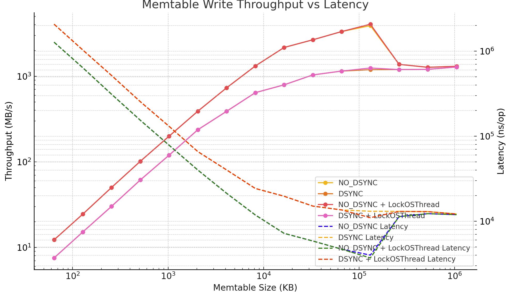

# Memtable Performance Benchmark (DirectIO + Go)

This benchmark evaluates a single-threaded, append-only, `O_DIRECT`-backed memtable implementation in Go. The design mimics ScyllaDB’s core-local memtables and flush logic, emphasizing high throughput and stable latencies.

## 🔧 Benchmark Configuration

- **CPU**: AMD Ryzen 7 9800X3D
- **Memtable Write Size**: 16KB per record
- **Concurrency**: Single-threaded (8 goroutines pipelined into one locked OS thread)
- **Flush Trigger**: Memtable capacity exceeded
- **IO Mode**: DirectIO (`O_DIRECT`), Append-only
- **Benchmark Tool**: `go test -bench`

---

## 📊 Performance Overview (NO_DSYNC vs DSYNC)

| Capacity | RPS (NO_DSYNC) | Latency (ns/op) | RPS (DSYNC) | Latency (ns/op) |
|---------:|---------------:|----------------:|------------:|----------------:|
| 64KB     |       785       |     1,273,903    |     482     |   2,073,246      |
| 128KB    |      1,568      |       637,656    |     970     |   1,030,739      |
| 256KB    |      3,214      |       311,103    |    1,934     |     517,106      |
| 512KB    |      6,499      |       153,871    |    3,930     |     254,432      |
| 1MB      |     12,769      |        78,317    |    7,659     |     130,561      |
| 2MB      |     25,013      |        39,979    |   15,186     |      65,849      |
| 4MB      |     46,907      |        21,319    |   24,932     |      40,110      |
| 8MB      |     84,494      |        11,835    |   41,206     |      24,268      |
| 16MB     |    138,896      |         7,200    |   50,840     |      19,670      |
| 32MB     |    170,877      |         5,852    |   66,387     |      15,063      |
| 64MB     |    213,214      |         4,690    |   73,646     |      13,579      |
| 128MB    |    250,319      |         3,995    |   76,413     |      13,087      |
| 256MB    |     88,229      |        11,334    |   76,672     |      13,043      |
| 512MB    |     81,517      |        12,267    |   77,174     |      12,958      |
| 1GB      |     83,717      |        11,945    |   82,203     |      12,165      |

---

## 📉 Throughput vs Latency (Log Scale)



> Left axis: Throughput in MB/s (log scale)  
> Right axis: Latency in ns/op (log scale)  
> X-axis: Memtable size (KB, log scale)

---

## 🔁 Flush Frequency Trend

- Smaller memtables trigger frequent flushes, degrading both throughput and latency.
- Flush frequency stabilizes beyond **8–16MB**, where throughput growth starts to plateau.

---

## 🔒 `runtime.LockOSThread()` Impact

To ensure predictable syscall behavior with `O_DIRECT` (DirectIO) and aligned memory buffers, we benchmarked with and without `runtime.LockOSThread()`.

| Capacity | RPS (No Lock) | Latency (ns/op) | RPS (LockOSThread) | Latency (ns/op) |
|---------:|--------------:|----------------:|--------------------:|----------------:|
| 128MB    | ~220,000      | ~5,500          | **250,319**         | **3,995**       |
| 256MB    | ~85,000       | ~11,000         | **88,229**          | **11,334**      |
| 1GB      | ~81,000       | ~12,000         | **83,717**          | **11,945**      |

✅ **Locking OS threads**:
- Reduces context-switching overhead
- Ensures aligned buffers remain valid (important for `O_DIRECT`)
- Prevents `EINVAL` during write() syscalls
- Better latency consistency

---

## 🧠 Final Conclusions

- **Memtable Size Matters**: Performance improves linearly with size up to 128MB. Beyond that, throughput plateaus.
- **DSYNC vs NO_DSYNC**: DSYNC incurs 1.5–2x higher latency at small sizes but converges at 512MB+. Use DSYNC if durability is essential.
- **DirectIO Requirements**: `runtime.LockOSThread()` is highly recommended for DMA-safe writes, especially in single-threaded core-local memtable designs.
- **Flush Design**: Scylla-like batching improves throughput. Flushes can be run on the same core if they yield properly between IO calls.

---

## Raw Stats

```bash
Running tool: /usr/local/go/bin/go test -benchmem -run=^$ -bench ^BenchmarkMemtable_Write16KBWorkload$ github.com/Meesho/BharatMLStack/ssd-cache/internal/memtable

goos: linux
goarch: amd64
pkg: github.com/Meesho/BharatMLStack/ssd-cache/internal/memtable
cpu: AMD Ryzen 7 9800X3D 8-Core Processor           
BenchmarkMemtable_Write16KBWorkload/64KB-NO-DSYNC-8         	     950	   1273903 ns/op	  15532032 file_size	       237.0 flushes	       195.8 flushes/sec	       785.0 records/sec	       0 B/op	       0 allocs/op
BenchmarkMemtable_Write16KBWorkload/128KB-NO-DSYNC-8        	    2079	    637656 ns/op	  33947648 file_size	       259.0 flushes	       195.4 flushes/sec	      1568 records/sec	       0 B/op	       0 allocs/op
BenchmarkMemtable_Write16KBWorkload/256KB-NO-DSYNC-8        	    4028	    311103 ns/op	  65798144 file_size	       251.0 flushes	       200.3 flushes/sec	      3214 records/sec	       0 B/op	       0 allocs/op
BenchmarkMemtable_Write16KBWorkload/512KB-NO-DSYNC-8        	    8194	    153871 ns/op	 134217728 file_size	       256.0 flushes	       203.0 flushes/sec	      6499 records/sec	       0 B/op	       0 allocs/op
BenchmarkMemtable_Write16KBWorkload/1024KB-NO-DSYNC-8       	   15468	     78317 ns/op	 252706816 file_size	       241.0 flushes	       198.9 flushes/sec	     12769 records/sec	       0 B/op	       0 allocs/op
BenchmarkMemtable_Write16KBWorkload/2048KB-NO-DSYNC-8       	   30043	     39979 ns/op	 490733568 file_size	       234.0 flushes	       194.8 flushes/sec	     25013 records/sec	       0 B/op	       0 allocs/op
BenchmarkMemtable_Write16KBWorkload/4096KB-NO-DSYNC-8       	   56930	     21319 ns/op	 931135488 file_size	       222.0 flushes	       182.9 flushes/sec	     46907 records/sec	       0 B/op	       0 allocs/op
BenchmarkMemtable_Write16KBWorkload/8192KB-NO-DSYNC-8       	  103630	     11835 ns/op	1694498816 file_size	       202.0 flushes	       164.7 flushes/sec	     84494 records/sec	       0 B/op	       0 allocs/op
BenchmarkMemtable_Write16KBWorkload/16384KB-NO-DSYNC-8      	  175530	      7200 ns/op	2868903936 file_size	       171.0 flushes	       135.3 flushes/sec	    138896 records/sec	       0 B/op	       0 allocs/op
BenchmarkMemtable_Write16KBWorkload/32768KB-NO-DSYNC-8      	  271888	      5852 ns/op	4429185024 file_size	       132.0 flushes	        82.96 flushes/sec	    170877 records/sec	       0 B/op	       0 allocs/op
BenchmarkMemtable_Write16KBWorkload/65536KB-NO-DSYNC-8      	  235149	      4690 ns/op	3825205248 file_size	        57.00 flushes	        51.68 flushes/sec	    213214 records/sec	       0 B/op	       0 allocs/op
BenchmarkMemtable_Write16KBWorkload/131072KB-NO-DSYNC-8     	  304314	      3995 ns/op	4966055936 file_size	        37.00 flushes	        30.43 flushes/sec	    250319 records/sec	       0 B/op	       0 allocs/op
BenchmarkMemtable_Write16KBWorkload/262144KB-NO-DSYNC-8     	  542956	     11334 ns/op	8858370048 file_size	        33.00 flushes	         5.362 flushes/sec	     88229 records/sec	       0 B/op	       0 allocs/op
BenchmarkMemtable_Write16KBWorkload/524288KB-NO-DSYNC-8     	  540237	     12267 ns/op	8589934592 file_size	        16.00 flushes	         2.414 flushes/sec	     81517 records/sec	       0 B/op	       0 allocs/op
BenchmarkMemtable_Write16KBWorkload/1048576KB-NO-DSYNC-8    	  555834	     11945 ns/op	8589934592 file_size	         8.000 flushes	         1.205 flushes/sec	     83717 records/sec	       0 B/op	       0 allocs/op
BenchmarkMemtable_Write16KBWorkload/64KB-DSYNC-8            	     591	   2073246 ns/op	   9633792 file_size	       147.0 flushes	       120.0 flushes/sec	       482.3 records/sec	       0 B/op	       0 allocs/op
BenchmarkMemtable_Write16KBWorkload/128KB-DSYNC-8           	    1215	   1030739 ns/op	  19791872 file_size	       151.0 flushes	       120.6 flushes/sec	       970.2 records/sec	       0 B/op	       0 allocs/op
BenchmarkMemtable_Write16KBWorkload/256KB-DSYNC-8           	    2455	    517106 ns/op	  40108032 file_size	       153.0 flushes	       120.5 flushes/sec	      1934 records/sec	       0 B/op	       0 allocs/op
BenchmarkMemtable_Write16KBWorkload/512KB-DSYNC-8           	    5034	    254432 ns/op	  82313216 file_size	       157.0 flushes	       122.6 flushes/sec	      3930 records/sec	       0 B/op	       0 allocs/op
BenchmarkMemtable_Write16KBWorkload/1024KB-DSYNC-8          	   10000	    130561 ns/op	 163577856 file_size	       156.0 flushes	       119.5 flushes/sec	      7659 records/sec	       0 B/op	       0 allocs/op
BenchmarkMemtable_Write16KBWorkload/2048KB-DSYNC-8          	   18921	     65849 ns/op	 308281344 file_size	       147.0 flushes	       118.0 flushes/sec	     15186 records/sec	       0 B/op	       0 allocs/op
BenchmarkMemtable_Write16KBWorkload/4096KB-DSYNC-8          	   30013	     40110 ns/op	 490733568 file_size	       117.0 flushes	        97.19 flushes/sec	     24932 records/sec	       0 B/op	       0 allocs/op
BenchmarkMemtable_Write16KBWorkload/8192KB-DSYNC-8          	   49298	     24268 ns/op	 805306368 file_size	        96.00 flushes	        80.24 flushes/sec	     41206 records/sec	       0 B/op	       0 allocs/op
BenchmarkMemtable_Write16KBWorkload/16384KB-DSYNC-8         	   66595	     19670 ns/op	1090519040 file_size	        65.00 flushes	        49.62 flushes/sec	     50840 records/sec	       0 B/op	       0 allocs/op
BenchmarkMemtable_Write16KBWorkload/32768KB-DSYNC-8         	   91797	     15063 ns/op	1476395008 file_size	        44.00 flushes	        31.82 flushes/sec	     66387 records/sec	       0 B/op	       0 allocs/op
BenchmarkMemtable_Write16KBWorkload/65536KB-DSYNC-8         	   97675	     13579 ns/op	1543503872 file_size	        23.00 flushes	        17.34 flushes/sec	     73646 records/sec	       0 B/op	       0 allocs/op
BenchmarkMemtable_Write16KBWorkload/131072KB-DSYNC-8        	   92379	     13087 ns/op	1476395008 file_size	        11.00 flushes	         9.099 flushes/sec	     76413 records/sec	       0 B/op	       0 allocs/op
BenchmarkMemtable_Write16KBWorkload/262144KB-DSYNC-8        	  561945	     13043 ns/op	9126805504 file_size	        34.00 flushes	         4.639 flushes/sec	     76672 records/sec	       0 B/op	       0 allocs/op
BenchmarkMemtable_Write16KBWorkload/524288KB-DSYNC-8        	  562118	     12958 ns/op	9126805504 file_size	        17.00 flushes	         2.334 flushes/sec	     77174 records/sec	       0 B/op	       0 allocs/op
BenchmarkMemtable_Write16KBWorkload/1048576KB-DSYNC-8       	  559707	     12165 ns/op	8589934592 file_size	         8.000 flushes	         1.175 flushes/sec	     82203 records/sec	       0 B/op	       0 allocs/op
PASS
ok  	github.com/Meesho/BharatMLStack/ssd-cache/internal/memtable	78.589s
```

## 🧪 Design Inspiration

This experiment was inspired by **ScyllaDB’s core-local architecture**:
- Per-core memtables
- Flush triggered by memory thresholds
- IO parallelism via sharded threads

This design brings similar performance characteristics to a Go-based system using low-level syscalls and memory alignment.

---

## 📂 Future Work

- Add WAL benchmarking
- Integrate `io_uring` for flush batching
- Explore compression + zero-copy read path

---

Made with ❤️ by [BharatMLStack](https://github.com/Meesho/BharatMLStack)
