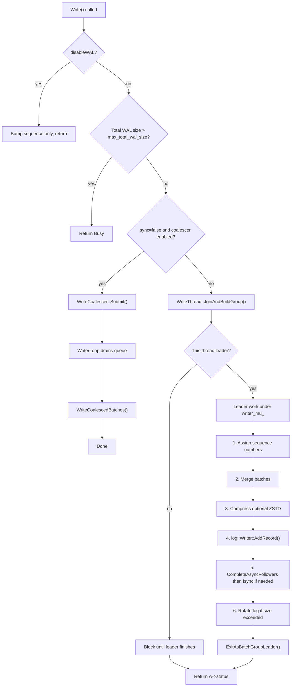

# How mwal Works

A guide for anyone who wants to understand the mwal Write-Ahead Log library: from simple concepts to technical internals, plus a map for reading the codebase.

---

## Part 1: What Is a WAL and Why Do You Need One?

### The idea in plain terms

Imagine you run a whiteboard where you keep your important data. Before you change anything on the whiteboard, you first write the change in a **notebook** in order. If the power goes out or the process crashes, you can reopen the notebook and replay every entry to bring the whiteboard back to the state it was in. The notebook is the **Write-Ahead Log (WAL)**: you write to it *before* (or as part of) updating your main store.

### What problems a WAL solves

- **Crash safety** — Changes are recorded in a durable log. After a crash, you replay the log to reconstruct what happened.
- **Durability** — You can force the log to disk (e.g. `fsync`) so that even if the machine dies, committed data is not lost.
- **Atomicity** — A batch of operations (e.g. several key-value updates) can be written as one log record, so they either all appear after recovery or none do.

### Where mwal fits

**mwal** is a **standalone WAL library**. It is derived from RocksDB’s WAL subsystem but is usable on its own: there is no LSM tree, no memtable, no SST files — just the log. You use it to append ordered, recoverable records to disk. What you do with those records (e.g. apply them to your own key-value store, index, or vector DB) is up to you.

---

## Part 2: What Can mwal Do?

### Write data atomically

You group multiple key-value operations (Put, Delete, Merge, etc.) into a single **WriteBatch**. When you write that batch to the WAL, it is stored as one log record. After recovery, either the whole batch is replayed or none of it is — no partial batches.

### Recover after crashes

You can replay all log files from disk in order. mwal reads each record, reconstructs the WriteBatch, and invokes your callback so you can re-apply the operations to your main store. After recovery, sequence numbers continue from the last replayed batch.

### Rotate log files

When the current log file grows beyond a configured size (`max_wal_file_size`), mwal flushes and closes it and starts a new one (e.g. `000001.log` → `000002.log`). This keeps individual files bounded and makes purge and archival easier.

### Purge old logs

You can remove WAL files you no longer need: by **TTL** (delete files older than N seconds), by **total size** (delete oldest until total is under a limit), or by **minimum log number** (never delete files needed for recovery or replication). Purge can run manually or on a background interval.

### Iterate over the log

You can open a **WalIterator** starting from a given sequence number and read subsequent records one by one. This is useful for replication, change-data-capture, or any consumer that needs to tail the log from a known point.

### Compress entries

Optional **ZSTD** compression can be enabled so that each log record (the serialized WriteBatch) is compressed before being written. This reduces disk usage; decompression happens automatically on read and recovery.

### Handle concurrent writers

Multiple threads can call `Write()` at the same time. mwal batches them using **group commit**: one thread becomes the “leader” and merges several pending batches into a single write and (optionally) a single fsync. This reduces lock contention and improves throughput.

### Back-pressure

If total WAL size on disk exceeds `max_total_wal_size`, `Write()` returns `Status::Busy`. The application can slow down or wait until purge (or other means) frees space, then retry.

### Directory locking

Only one process can open a given WAL directory at a time. mwal uses a lock file (`LOCK`) in the directory; a second open of the same directory fails until the first process closes.

---

## Part 3: Quick Start — How to Use mwal

### 1. Open a WAL

```cpp
#include "mwal/db_wal.h"
#include "mwal/env.h"
#include "mwal/options.h"

mwal::WALOptions opts;
opts.wal_dir = "/path/to/wal_dir";
mwal::Env* env = mwal::Env::Default();

std::unique_ptr<mwal::DBWal> wal;
mwal::Status s = mwal::DBWal::Open(opts, env, &wal);
if (!s.ok()) { /* handle error */ }
```

`Open` creates the directory if missing, acquires the directory lock, discovers existing log files, and prepares for writes (or recovery).

### 2. Write a record

```cpp
mwal::WriteBatch batch;
batch.Put("key1", "value1");
batch.Put("key2", "value2");

mwal::WriteOptions wo;  // wo.sync = false by default
s = wal->Write(wo, &batch);
if (!s.ok()) { /* handle error */ }

// batch.Sequence() is now set to the first sequence number of this batch
```

Each `Write()` appends one or more batches to the WAL; with group commit, multiple threads’ batches may be merged into a single log record.

### 3. Recover after restart

**Option A — explicit recovery:**

```cpp
std::unique_ptr<mwal::DBWal> wal;
mwal::DBWal::Open(opts, env, &wal);

int count = 0;
s = wal->Recover([&count](mwal::SequenceNumber seq, mwal::WriteBatch* batch) {
  // Re-apply this batch to your store
  count += batch->Count();
  return mwal::Status::OK();
});
// New writes will use sequence numbers after the last recovered batch
```

**Option B — auto-recovery on Open:**

```cpp
opts.recovery_callback = [](mwal::SequenceNumber seq, mwal::WriteBatch* batch) {
  // Apply batch to your store
  return mwal::Status::OK();
};
std::unique_ptr<mwal::DBWal> wal;
mwal::DBWal::Open(opts, env, &wal);  // Replays existing WAL before returning
```

### 4. Iterate from a sequence number

```cpp
std::unique_ptr<mwal::WalIterator> it;
s = wal->NewWalIterator(8, &it);  // Start from sequence 8

while (it->Valid()) {
  mwal::SequenceNumber seq = it->GetSequenceNumber();
  const mwal::WriteBatch& batch = it->GetBatch();
  // Process batch (e.g. forward to replica)
  it->Next();
}
if (!it->status().ok()) { /* handle error */ }
```

The iterator sees a snapshot of WAL files at the time `NewWalIterator` was called.

### 5. Rotate and purge

```cpp
// Tell mwal not to purge files needed for replication / recovery
wal->SetMinLogNumberToKeep(42);

// List current WAL files
std::vector<mwal::WalFileInfo> files;
wal->GetLiveWalFiles(&files);

// Delete obsolete files (respects min_log_to_keep, TTL, size limit)
s = wal->PurgeObsoleteFiles();
```

Rotation happens automatically when the current log file exceeds `max_wal_file_size`. Purge is manual unless `purge_interval_seconds` is set.

### 6. Close

```cpp
s = wal->Close();
```

`Close` stops the async coalescer (if used), drains the write thread, stops the background purge thread, flushes and closes the current log file, and releases the directory lock.

---

## Part 4: Key Concepts

| Concept | Description |
|--------|-------------|
| **WriteBatch** | The unit of atomicity. A serialized list of operations (Put, Delete, Merge, etc.) with a single sequence number range. Binary format: `[sequence:8B][count:4B][record...]` where each record is `[type:1B][key_len:varint][key][value_len:varint][value]`. |
| **Sequence number** | A monotonically increasing 64-bit value assigned when a batch is written. Used for ordering and for starting iteration or recovery from a given point. |
| **Log file / segment** | A single `.log` file on disk (e.g. `000001.log`). The WAL is a sequence of such files; each has a log number. |
| **Log record** | One physical record inside a segment. If the payload is larger than one block (32 KB), it is split into First/Middle/Last fragments. |
| **Group commit** | Multiple concurrent writers are merged into one I/O: one thread (the leader) collects others’ batches, merges them, writes one log record, and optionally does one fsync. |
| **Write coalescer** | For async writes (`sync=false`), a dedicated thread drains a queue of batches and writes them in bulk, avoiding contention on the group-commit lock. When `max_async_flush_interval_ms > 0`, the writer also wakes after that interval so pending batches are flushed even without new submissions. |
| **Recovery mode** | Controls how corruption is handled during replay: tolerate bad tail, require full consistency, point-in-time, or skip corrupted records. |

---

## Part 5: How mwal Works Internally

### 5.1 The Write Path

High-level flow:



- **Leader–follower:** The first writer to acquire the write-thread lock becomes the leader; others wait. The leader forms a **WriteGroup** (up to `max_write_group_size` writers), merges their batches, and does one `AddRecord` and optionally one fsync.
- **Two-phase exit:** Non-sync followers are woken *before* fsync so they don’t wait for durability they didn’t request. Sync followers are woken after fsync.
- **Hybrid routing:** If `sync=false` and `max_async_queue_depth > 0`, the batch is submitted to the **WriteCoalescer**. A background thread drains the queue and calls `WriteCoalescedBatches`, which merges batches and writes under `writer_mu_` (no group-commit lock for the calling threads). If `max_async_flush_interval_ms > 0`, the writer wakes on that interval as well, so idle batches are flushed within roughly that time instead of waiting indefinitely for the next submit.

### 5.2 The On-Disk Format

**Directory layout:**

```
wal_dir/
  LOCK           # flock; one process per directory
  000001.log     # First segment
  000002.log     # After rotation
  ...
```

**Block format (32 KB blocks):**

Each block contains one or more physical records. Record header (non-recyclable, 7 bytes):

| Field   | Size | Description        |
|--------|------|--------------------|
| CRC32C | 4 B  | Checksum (masked)  |
| Length | 2 B  | Payload length      |
| Type   | 1 B  | Full / First / Middle / Last |

Payload follows. Blocks are padded with zeros if the last record doesn’t align. Records larger than one block are split into First, Middle, and Last fragments.

**WriteBatch payload (inside the log record):**

- Optional **compression prefix**: `0x00` = uncompressed, `0x07` = ZSTD.
- Then: `[sequence:8B][count:4B]` followed by repeated `[type:1B][key_len:varint][key][value_len:varint][value]`.

### 5.3 The Recovery Path

1. `Recover()` asks **WalManager** for a sorted list of WAL files.
2. For each file in order: open as `SequentialFile` → create `log::Reader` → loop calling `ReadRecord()` with the chosen **WALRecoveryMode**.
3. For each record: decompress (if needed), build a WriteBatch from the payload, track max sequence number, and call the user callback with `(seq, &batch)`.
4. After all files: set `last_sequence_` to the max sequence, close the current log writer, and call `NewLogFile()` so new writes go to a fresh file.

**Recovery modes:**

| Mode | Behavior |
|------|----------|
| `kTolerateCorruptedTailRecords` | Replay until first corruption; ignore tail corruption. |
| `kAbsoluteConsistency` | Stop and return error on any corruption or truncated file. |
| `kPointInTimeRecovery` | Default; replay as much as possible, stop on corruption. |
| `kSkipAnyCorruptedRecords` | Skip corrupted records and continue. |

### 5.4 Log Rotation and Purge

- **Rotation:** After a write, if `max_wal_file_size > 0` and the current log file size exceeds it, mwal flushes and closes the file and opens the next one (`RotateLogFile()` → `NewLogFile()`).
- **Purge** (`WalManager::PurgeObsoleteWALFiles()`):
  - Never deletes files with `log_number >= min_log_to_keep`.
  - If `WAL_ttl_seconds > 0`: delete files whose modification time is older than TTL.
  - If `WAL_size_limit_MB > 0`: delete oldest files until total size is under the limit.
  - Otherwise: delete files below `min_log_to_keep`.
- If `purge_interval_seconds > 0`, a background thread periodically calls `PurgeObsoleteFiles()`.

### 5.5 The WalIterator

- `NewWalIterator(start_seq)` takes a snapshot of the current WAL file list and builds an iterator that reads those files in order.
- It opens each file, uses `log::Reader::ReadRecord()`, decompresses, and skips records whose sequence range is entirely before `start_seq`.
- Interface: `Valid()`, `Next()`, `GetBatch()`, `GetSequenceNumber()`, `status()`.

### 5.6 Concurrency Model

| Component | Role |
|-----------|------|
| `writer_mu_` | Serializes actual I/O; only the leader (or coalescer thread) holds it. |
| `WriteThread::mu_` | Serializes group formation; held briefly when joining/building group. |
| `WriteCoalescer::mu_` | Protects the async queue and writer loop state. |
| Atomics | `last_sequence_`, `log_number_`, `min_log_to_keep_`, `shutdown_` for lock-free reads and coordination. |
| Readers | WalIterator uses its own snapshot of file list; no writer lock. |

---

## Part 6: Configuration Reference

### WALOptions

| Option | Type | Default | Description |
|--------|------|---------|-------------|
| `wal_dir` | `std::string` | (empty) | Directory for WAL files. Required. |
| `WAL_ttl_seconds` | `uint64_t` | 0 | Delete WAL files older than this many seconds. 0 = disabled. |
| `WAL_size_limit_MB` | `uint64_t` | 0 | Purge oldest files when total size exceeds this (MB). 0 = disabled. |
| `wal_recovery_mode` | `WALRecoveryMode` | `kPointInTimeRecovery` | How to handle corruption during recovery. |
| `manual_wal_flush` | `bool` | false | If true, log writer does not auto-flush after each record. |
| `wal_compression` | `CompressionType` | `kNoCompression` | Compression for log records (e.g. `kZSTD`). |
| `max_wal_file_size` | `uint64_t` | 256 MiB | Rotate when current file exceeds this. 0 = no limit. |
| `recovery_callback` | `std::function<...>` | (unset) | If set, `Open()` replays existing WAL via this callback before accepting writes. |
| `purge_interval_seconds` | `uint64_t` | 0 | Background purge interval. 0 = manual purge only. |
| `max_write_group_size` | `size_t` | 0 | Max writers per group commit. 0 = no limit. |
| `max_total_wal_size` | `uint64_t` | 0 | Write() returns Busy when total WAL size exceeds this. 0 = no limit. |
| `max_async_queue_depth` | `size_t` | 10000 | Max pending async writes in coalescer queue. 0 = disable coalescer. |
| `max_async_flush_interval_ms` | `uint64_t` | 0 | Max time in ms before pending async batches are flushed. 0 = disabled (flush only on new Submit or Stop). |

### WriteOptions

| Option | Type | Default | Description |
|--------|------|---------|-------------|
| `sync` | `bool` | false | If true, fsync after this write. |
| `disableWAL` | `bool` | false | If true, do not write to WAL; only advance sequence number. |

---

## Part 7: Codebase Reading Map

Use this map to read the code in an order that matches what you want to understand.

### Level 1: Understand the Public API (start here)

1. **`include/mwal/options.h`** — All configuration: `WALOptions`, `WriteOptions`, `WALRecoveryMode`.
2. **`include/mwal/db_wal.h`** — Main API: `Open`, `Write`, `Recover`, `FlushWAL`, `SyncWAL`, `Close`, sequence/log number, purge, iterator.
3. **`include/mwal/write_batch.h`** — The data unit: `Put`, `Delete`, `Merge`, `Iterate`, binary format, `Handler`.
4. **`examples/wal_client.cc`** — Minimal examples for open, write, recover, rotation, purge, iterator, sync, lock, back-pressure, compression.

### Level 2: Understand the Write Path

5. **`src/wal/db_wal.cc`** — `Write()`, `Open()`, `Close()`, `Recover()`, `WriteCoalescedBatches()`, rotation, back-pressure, two-phase exit.
6. **`src/wal/write_thread.h`** and **`src/wal/write_thread.cc`** — Group commit: `JoinAndBuildGroup`, `EnterAsBatchGroupLeader`, `CompleteAsyncFollowers`, `ExitAsBatchGroupLeader`.
7. **`src/wal/write_coalescer.h`** and **`src/wal/write_coalescer.cc`** — Async path: queue, `Submit()`, `WriterLoop()`, back-pressure when queue is full.
8. **`src/wal/wal_compressor.h`** and **`src/wal/wal_compressor.cc`** — Compression prefix, ZSTD compress/decompress for log records.

### Level 3: Understand the Log Format

9. **`src/log/log_format.h`** — Constants: block size (32 KB), header size, record types (Full, First, Middle, Last).
10. **`src/log/log_writer.h`** and **`src/log/log_writer.cc`** — How records are fragmented into blocks, CRC, padding.
11. **`src/log/log_reader.h`** and **`src/log/log_reader.cc`** — How blocks are read and records reassembled, CRC check, recovery mode.
12. **`src/file/writable_file_writer.h`** and **`src/file/writable_file_writer.cc`** — Buffered append, flush, sync.
13. **`src/file/sequential_file_reader.h`** and **`src/file/sequential_file_reader.cc`** — Sequential read wrapper.

### Level 4: Understand File Management and Recovery

14. **`src/wal/wal_manager.h`** and **`src/wal/wal_manager.cc`** — Scan WAL dir, `GetSortedWalFiles`, purge (TTL, size, min_log_to_keep).
15. **`src/wal/wal_iterator.cc`** — Pull-based reader: file snapshot, advance to `start_seq`, decompress, expose `GetBatch`/`GetSequenceNumber`.

### Level 5: Understand the Platform Layer

16. **`include/mwal/env.h`** — File system abstraction: `WritableFile`, `SequentialFile`, `Env` (NewWritableFile, NewSequentialFile, LockFile, etc.).
17. **`src/env/env_posix.cc`** — POSIX implementation: open, read, write, flock on LOCK, directory listing.
18. **`include/mwal/status.h`** and **`include/mwal/io_status.h`** — Status codes, subcodes, IOStatus with retryable/data-loss.
19. **`src/util/crc32c.h`** and **`src/util/crc32c.cc`** — CRC32C for log block checksums.
20. **`src/util/coding.h`** and **`src/util/coding.cc`** — Varint encoding used in WriteBatch and log format.

### Level 6: Understand Testing and Benchmarks

21. **`test/db_wal_test.cc`** — Integration tests: open/close, write, recovery, rotation, concurrent writes, compression, purge, iterator, back-pressure.
22. **`test/crash_recovery_test.cc`** — Recovery behavior: truncation, corruption, recovery mode matrix, multi-file.
23. **`test/concurrency_race_test.cc`** — Concurrent close, purge, iterator, rotation, sync/async mixing, leader election.
24. **`bench/db_wal_bench.cc`** — Throughput and latency benchmarks for writes, recovery, rotation, coalescer, compression.

---

For more design rationale and optimization details, see `docs/WAL_DESIGN.md` and `docs/OPTIMIZATION_SUMMARY.md`. For running tests and benchmarks, see `docs/TESTING.md` and `docs/BENCHMARK_RESULTS.md`.
