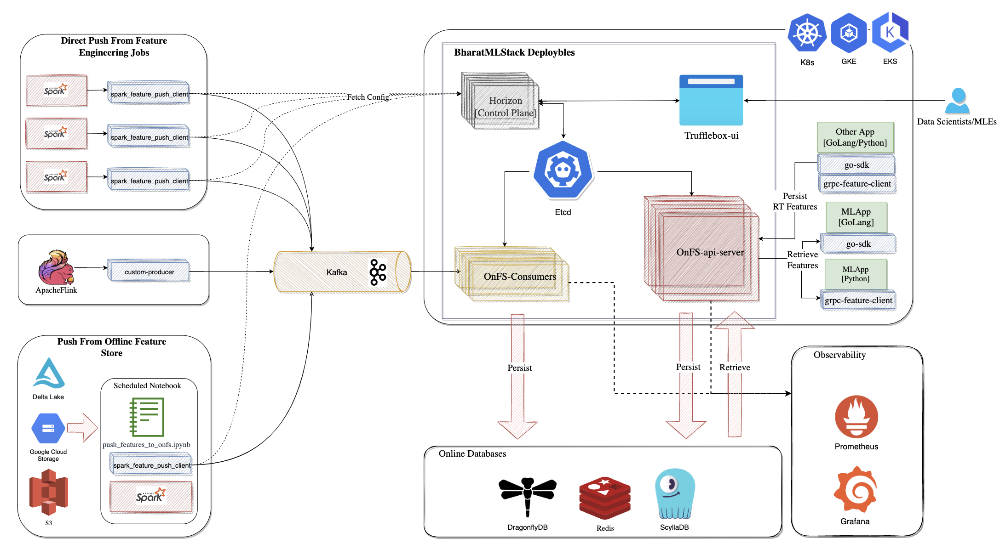

<p align="center">
  
</p>

----
# BharatMLStack's Online Feature Store: A Hyper-Scalable Feature Store for Real-Time ML
 


[](https://discord.gg/XkT7XsV2AU)

Online-feature-store is a high-performance, scalable, and production-grade feature store built for modern machine learning systems. It supports both **real-time** and **batch** workflows, with a strong emphasis on **developer experience**, **system observability**, and **low-latency feature retrieval**.

Designed for high-scale real-time inference workloads, Online-feature-store ensures:

- ⚡️ **Ultra-low latency** - Ultra-low retrieval times at scale
- 🚀 **High throughput** - Tested to serve millions of QPS with hundreds of entity IDs per request
- 🛡️ **High availability** - Designed for mission-critical ML systems with multi-layer storage
- 🧠 **Multi-format support** - Scalar, vector/embedding, and quantized feature types
- 📈 **Comprehensive observability** - Full metrics with Prometheus and Grafana
- 🔄 **Hybrid ingestion** - Seamless batch and real-time feature updates

## 🏗️ Architecture

Online-feature-store consists of several key components working together:

- **Feature Generation** - Ingest features from existing offline sources or custom feature pipelines
- **Kafka Layer** - Buffered streaming ingestion with flow control
- **Horizon Control Plane** - Configuration management with TruffleBox UI
- **Online-feature-store Consumer** - Ingestion workhorse for writes into online stores
- **Online-feature-store gRPC API Server** - Low-latency feature retrieval and high-consistency ingestion
- **Storage Backends** - Redis/Dragonfly for caching and ScyllaDB for persistence



## 🚀 Quick Start

For detailed setup instructions, see the [**Quick Start Guide**](quick-start/README.md).

## 🧰 SDKs

Online-feature-store provides SDKs to interact with the feature store:

- **[Go SDK](sdks/go/README.md)** - For backend services and ML inference
- **[Python SDK](sdks/python/README.md)** - For feature ingestion and Spark jobs


## 📊 Use Cases

Online-feature-store is ideal for:

- **Real-time inference** - Low-latency feature serving for online ML models, like Ranking and Recommendation, Fraud detection, Search, Dynamic pricing and bidding, real-time notification etc real time 
- **Feature Catalogue** - Centralized feature registry for organizations
- **Flexible Data Ingestion** - Support for batch processing, streaming pipelines, and real-time data sources with unified ingestion APIs


## 📚 Documentation

| Version |  Link |
|---------|-------------------|
| v1.0.0  | [Documentation](https://meesho.github.io/BharatMLStack/online-feature-store/v1.0.0) |
| v1.0.0  | [User Guide](https://meesho.github.io/BharatMLStack/trufflebox-ui/v1.0.0/userguide) |

## Development

### Prerequisites

- Go 1.22 or later
- Database (PostgreSQL/MySQL)
- Docker (optional, for containerization)
- Start the infrastructure using quick-start interactive startup

### Getting Started

```bash
# Clone and navigate to the project
cd online-feature-store

# Install dependencies
go mod download

# Set up environment variables
# For api-server
cp env-api-server.example ./cmd/api-server/.env

# For consumer
cp env-consumer.example ./cmd/consumer/.env
# Edit .env with your configuration

# Run tests
go test -v ./...

# Build the application
go build -v ./cmd/api-server
go build -v ./cmd/consumer

# Run the service
# Run api-server
bash -c 'set -a; source ./cmd/api-server/.env; set +a; exec go run ./cmd/api-server'

# Run consumer
bash -c 'set -a; source ./cmd/consumer/.env; set +a; exec go run ./cmd/consumer'
```

### Configuration

Create a `.env` file or set environment variables. Configuration is organized into **common settings** (shared between api-server and consumer) and **service-specific settings**.

## Common Configuration (api-server + consumer)
These settings must be **identical** across both api-server and consumer for proper operation:

```bash
# APPLICATION CONFIGURATION - Basic app settings
APP_ENV=prod
APP_NAME=onfs
APP_METRIC_SAMPLING_RATE=1

# ETCD CONFIGURATION - Distributed configuration management
ETCD_SERVER=127.0.0.1:2379
ETCD_WATCHER_ENABLED=true

# REDIS FAILOVER CONFIGURATION - Distributed caching or redis storage layer
# Can be used for either distributed caching or as a redis storage layer
STORAGE_REDIS_FAILOVER_2_SENTINEL_ADDRESSES=localhost:26379
STORAGE_REDIS_FAILOVER_2_DB=0
STORAGE_REDIS_FAILOVER_2_DISABLE_IDENTITY=true
STORAGE_REDIS_FAILOVER_2_MASTER_NAME=mymaster
STORAGE_REDIS_FAILOVER_2_MAX_IDLE_CONN=32
STORAGE_REDIS_FAILOVER_2_MIN_IDLE_CONN=20
STORAGE_REDIS_FAILOVER_2_MAX_ACTIVE_CONN=32
STORAGE_REDIS_FAILOVER_2_MAX_RETRY=-1
STORAGE_REDIS_FAILOVER_2_POOL_FIFO=false
STORAGE_REDIS_FAILOVER_2_READ_TIMEOUT_IN_MS=3000
STORAGE_REDIS_FAILOVER_2_WRITE_TIMEOUT_IN_MS=3000
STORAGE_REDIS_FAILOVER_2_POOL_TIMEOUT_IN_MS=3000
STORAGE_REDIS_FAILOVER_2_POOL_SIZE=32
STORAGE_REDIS_FAILOVER_2_CONN_MAX_IDLE_TIMEOUT_IN_MINUTES=15
STORAGE_REDIS_FAILOVER_2_CONN_MAX_AGE_IN_MINUTES=30

# SCYLLA DATABASE CONFIGURATION - Primary persistent storage
STORAGE_SCYLLA_1_CONTACT_POINTS=127.0.01
STORAGE_SCYLLA_1_KEYSPACE=onfs
STORAGE_SCYLLA_1_NUM_CONNS=1
STORAGE_SCYLLA_1_PORT=9042
STORAGE_SCYLLA_1_TIMEOUT_IN_MS=300000
STORAGE_SCYLLA_1_PASSWORD=
STORAGE_SCYLLA_1_USERNAME=

# ACTIVE STORAGE CONFIGURATION - Which storage backends to use
STORAGE_REDIS_FAILOVER_ACTIVE_CONFIG_IDS=2
STORAGE_SCYLLA_ACTIVE_CONFIG_IDS=1
```

## API-Server Specific Configuration
Additional settings required only for the api-server:

```bash
# Service-specific settings
APP_LOG_LEVEL=DEBUG
APP_PORT=8089

# IN-MEMORY CACHE CONFIGURATION - Local caching layer
IN_MEM_CACHE_3_ENABLED=true
IN_MEM_CACHE_3_NAME=onfs
IN_MEM_CACHE_3_SIZE_IN_BYTES=100
IN_MEM_CACHE_ACTIVE_CONFIG_IDS=3

# KUBERNETES/DEPLOYMENT CONFIGURATION - Pod and node identification
POD_IP=127.0.0.1
NODE_IP=127.0.0.1
```

## Consumer Specific Configuration
Additional settings required only for the consumer:

```bash
# Service-specific settings
APP_LOG_LEVEL=ERROR
APP_PORT=8090

# KAFKA CONSUMER CONFIGURATION - Feature ingestion from Kafka streams
KAFKA_CONSUMERS_FEATURE_CONSUMER_AUTO_COMMIT_INTERVAL_MS=5000
KAFKA_CONSUMERS_FEATURE_CONSUMER_AUTO_OFFSET_RESET=latest
KAFKA_CONSUMERS_FEATURE_CONSUMER_BASIC_AUTH_CREDENTIAL_SOURCE=USER_INFO
KAFKA_CONSUMERS_FEATURE_CONSUMER_BATCH_SIZE=100
KAFKA_CONSUMERS_FEATURE_CONSUMER_BOOTSTRAP_SERVERS=lkc-r0yp97.domqgq513gn.asia-southeast1.gcp.confluent.cloud:9092
KAFKA_CONSUMERS_FEATURE_CONSUMER_CLIENT_ID=online-feature-store-consumer
KAFKA_CONSUMERS_FEATURE_CONSUMER_ENABLE_AUTO_COMMIT=true
KAFKA_CONSUMERS_FEATURE_CONSUMER_GROUP_ID=online-feature-store-consumer
KAFKA_CONSUMERS_FEATURE_CONSUMER_LISTENER_CONCURRENCY=2
KAFKA_CONSUMERS_FEATURE_CONSUMER_MAX_WORKERS=50
KAFKA_CONSUMERS_FEATURE_CONSUMER_POLL_TIMEOUT=1000
KAFKA_CONSUMERS_FEATURE_CONSUMER_SASL_MECHANISM=PLAIN
KAFKA_CONSUMERS_FEATURE_CONSUMER_SASL_PASSWORD=ssl_password
KAFKA_CONSUMERS_FEATURE_CONSUMER_SASL_USERNAME=sasl_user_name
KAFKA_CONSUMERS_FEATURE_CONSUMER_SECURITY_PROTOCOL=SASL_SSL
KAFKA_CONSUMERS_FEATURE_CONSUMER_TOPIC=online-feature-store.feature_ingestion
```

---

## 🧯 Distributed Cache Circuit Breaker - Example Configuration

If you want to activate the circuit breaker over the distributed cache, you can create the following configuration keys in `etcd` to control its behavior (typically at `/config/orion-v2/circuitbreaker/distributed_cache/*`):

```bash
# Active CB keys for distributed cache retrieval (example JSON value)
etcdctl put /config/orion-v2/circuitbreaker/distributed_cache/active-cb-keys '{
  "distributed_cache_retrieval": {
    "enabled": true,
    "forced-state": 0
  }
}'

# Basic boolean flags and thresholds
etcdctl put /config/orion-v2/circuitbreaker/distributed_cache/enabled true
etcdctl put /config/orion-v2/circuitbreaker/distributed_cache/failure-count-threshold 0
etcdctl put /config/orion-v2/circuitbreaker/distributed_cache/failure-count-window 0
etcdctl put /config/orion-v2/circuitbreaker/distributed_cache/failure-rate-minimum-window 1000
etcdctl put /config/orion-v2/circuitbreaker/distributed_cache/failure-rate-threshold 10
etcdctl put /config/orion-v2/circuitbreaker/distributed_cache/failure-rate-window-in-ms 60000
etcdctl put /config/orion-v2/circuitbreaker/distributed_cache/name distributed_cache
etcdctl put /config/orion-v2/circuitbreaker/distributed_cache/success-count-threshold 900
etcdctl put /config/orion-v2/circuitbreaker/distributed_cache/success-count-window 1000
etcdctl put /config/orion-v2/circuitbreaker/distributed_cache/version 1
etcdctl put /config/orion-v2/circuitbreaker/distributed_cache/with-delay-in-ms 10000
```

> **Note:**  
> These keys (and values) tell the ONFS platform to enable circuit breaking over usage of distributed cache, and allow you to tune failure/success thresholds, time windows, and fallback state.  
> 
> All configuration updates to these keys in etcd are picked up dynamically by ONFS components.

---


# For Consumer:
Before running the consumer service, you can use quickstart to start kafka which is included in infrastructure services.

### Testing

```bash
# Clone and navigate to the project
cd online-feature-store

# Run all tests
go test -v ./...

# Run tests with coverage
go test -v -cover ./...

# Run specific test package
go test -v ./pkg/config/...

# Run integration tests
go test -v -tags=integration ./...
```

### Building - api-server

```bash
# Clone and navigate to the project
cd online-feature-store

# Build for current platform
go build -v ./cmd/api-server

# Build for production
make build

# Build for specific platform
GOOS=linux GOARCH=amd64 go build -v ./cmd/api-server
```

### Building - consumer

```bash
# Clone and navigate to the project
cd online-feature-store

# Build for current platform
go build -v ./cmd/consumer

# Build for production
make build

# Build for specific platform
GOOS=linux GOARCH=amd64 go build -v ./cmd/consumer
```

## Docker

### Building the Docker Image

```bash
# Clone and navigate to the project
cd online-feature-store

# Build Docker image - api-server
docker build -t onfs-api-server -f cmd/api-server/DockerFile .

# Build Docker image - consumer
docker build -t onfs-consumer -f cmd/consumer/DockerFile .

# Run container with environment variables
# For api-server
docker run -p 8080:8080 \
   --env-file ./cmd/api-server/.env \
   --network onfs-network \
  onfs-api-server
  
# For consumer
docker run -p 8080:8080 \
   --env-file ./cmd/consumer/.env \
   --network onfs-network \
  onfs-consumer
```

## Deployment

### Production with Docker

```bash
# Clone and navigate to the project
cd online-feature-store

# Build production image - api-server
docker build -t onfs-api-server:latest -f cmd/api-server/DockerFile .

# Build production image - consumer
docker build -t onfs-consumer:latest -f cmd/consumer/DockerFile .

# Run in production mode
# For API Server
docker run -d \
  --name onfs-api-server \
  -p 8080:8080 \
  --env-file ./cmd/api-server/.env \
  onfs-api-server:latest

# For Consumer
docker run -d \
  --name onfs-consumer \
  -p 8090:8090 \
  --env-file ./cmd/api-server/.env \
  onfs-consumer:latest
```

## Feature Store API Examples

### gRPC API Commands

Use the following `grpcurl` commands to interact with the Online Feature Store gRPC API:

**Persist Features:**
```bash
grpcurl -plaintext -H "online-feature-store-caller-id: <caller-id>" -H "online-feature-store-auth-token: <auth-token>" -d '<request-body>' localhost:8089 persist.FeatureService/PersistFeatures
```

**Retrieve Features (Decoded):**
```bash
grpcurl -plaintext -H "online-feature-store-caller-id: <caller-id>" -H "online-feature-store-auth-token: <auth-token>" -d '<request-body>' localhost:8089 retrieve.FeatureService/RetrieveDecodedResult
```

**Retrieve Features (Binary):**
```bash
grpcurl -plaintext -H "online-feature-store-caller-id: <caller-id>" -H "online-feature-store-auth-token: <auth-token>" -d '<request-body>' localhost:8089 retrieve.FeatureService/RetrieveFeatures
```

### Sample Request Bodies

**Single Feature Group Persist:**
```json
{
    "data": [{
        "key_values": ["10"],
        "feature_values": [{
            "values": {"fp32_values": [123.45]}
        }]
    }],
    "entity_label": "catalog",
    "feature_group_schema": [{
        "label": "int_fg",
        "feature_labels": ["id"]
    }],
    "keys_schema": ["catalog_id"]
}
```

**Single Feature Group Retrieve:**
```json
{
    "entity_label": "catalog",
    "feature_groups": [{
        "label": "int_fg",
        "feature_labels": ["id"]
    }],
    "keys_schema": ["catalog_id"],
    "keys": [{"cols": ["10"]}]
}
```

**Multiple Feature Groups Persist:**
```json
{
    "data": [
        {
            "key_values": ["1"],
            "feature_values": [
                {"values": {"fp32_values": [28.5]}},
                {"values": {"string_values": ["Bharat"]}}
            ]
        },
        {
            "key_values": ["2"],
            "feature_values": [
                {"values": {"fp32_values": [32.0]}},
                {"values": {"string_values": ["India"]}}
            ]
        }
    ],
    "entity_label": "catalog",
    "feature_group_schema": [
        {"label": "int_fg", "feature_labels": ["id"]},
        {"label": "string_fg", "feature_labels": ["name"]}
    ],
    "keys_schema": ["catalog_id"]
}
```

**Multiple Feature Groups Retrieve:**
```json
{
    "entity_label": "catalog",
    "feature_groups": [
        {"label": "int_fg", "feature_labels": ["id"]},
        {"label": "string_fg", "feature_labels": ["name"]}
    ],
    "keys_schema": ["catalog_id"],
    "keys": [
        {"cols": ["1"]},
        {"cols": ["2"]}
    ]
}
```

**Vector Feature Group Persist:**
```json
{
    "data": [{
        "key_values": ["123"],
        "feature_values": [{
            "values": {
                "vector": [{
                    "values": {"fp32_values": [1.0, 2.0, 3.0, 4.0]}
                }]
            }
        }]
    }],
    "entity_label": "catalog",
    "feature_group_schema": [{
        "label": "vector_fg",
        "feature_labels": ["embedding"]
    }],
    "keys_schema": ["catalog_id"]
}
```

**Vector Feature Group Retrieve:**
```json
{
    "entity_label": "catalog",
    "feature_groups": [{
        "label": "vector_fg",
        "feature_labels": ["embedding"]
    }],
    "keys_schema": ["catalog_id"],
    "keys": [{"cols": ["123"]}]
}
```

### Key Points

**Only one type per feature value block:**
- `feature_values` is a list, and each item in the list has only one value type populated
- For example: one item has only `fp32_values`, another has only `int64_values`

**Field Types:**
The following value types are supported:

- **fp32_values**: `float32[]`
- **fp64_values**: `float64[]`
- **int32_values**: `int32[]`
- **int64_values**: `string[]` (because JSON doesn't support 64-bit ints directly)
- **uint32_values**: `uint32[]`
- **uint64_values**: `string[]`
- **string_values**: `string[]`
- **bool_values**: `bool[]`
- **vector**: list of objects with nested values (used for embedded features)

### Response Format Differences

- **Retrieve Features (Binary)**: Returns data in binary format for optimal performance and reduced network overhead
- **Retrieve Features (Decoded)**: Returns data in human-readable string format for easier debugging and development purposes

## Feature Ingestion Flows

BharatMLStack Online Feature Store supports two primary methods for ingesting features:

### 1. Direct gRPC API Ingestion

Use the ONFS API Server for synchronous, request-response feature operations:

```bash
# Persist features directly via gRPC
grpcurl -plaintext -H "online-feature-store-caller-id: <caller-id>" \
  -H "online-feature-store-auth-token: <auth-token>" \
  -d '<request-body>' localhost:8089 persist.FeatureService/PersistFeatures
```

**When to use:**
- Real-time feature updates requiring immediate confirmation
- Low-latency synchronous operations
- Direct integration with applications

### 2. Kafka Consumer Ingestion

The ONFS Consumer service provides asynchronous, stream-based feature ingestion:

**Architecture:**
```
Producer → Kafka Topic → ONFS Consumer → Redis/Scylla
```

**How it works:**
1. Applications publish feature data to Kafka topic: `online-feature-store.feature_ingestion`
2. ONFS Consumer reads messages from Kafka in batches
3. Features are persisted to configured storage backends (Redis/Scylla)
4. Consumer handles retries and error scenarios automatically

**Configuration:**
- **Kafka Topic**: `online-feature-store.feature_ingestion`
- **Consumer Port**: 8090
- **Health Check**: http://localhost:8090/health/self
- **Bootstrap Servers**: `broker:29092` (internal), `localhost:9092` (external)

**Publishing Features to Kafka:**

**Option 1: Using Python Producer Script (Recommended)**

The repository includes a ready-to-use Python script that sends protobuf-encoded messages:

```bash
# Install dependencies
pip install kafka-python
cd ../online-feature-store/py-sdk/bharatml_commons
pip install -e .

# Navigate to the script directory
cd ../online-feature-store/examples/notebook

# Send sample data (sub_order example with protobuf encoding)
python sample_kafka_producer.py --sample

# Send custom data from a JSON file
python sample_kafka_producer.py --file my_features.json

# Send multiple messages (for load testing)
python sample_kafka_producer.py --sample --count 100

# Show the data being sent (with JSON and protobuf representation)
python sample_kafka_producer.py --sample --show-json

# Use a different broker or topic
python sample_kafka_producer.py --sample --broker localhost:9092 --topic my-custom-topic
```

**Sample JSON format for custom data file:**
```json
{
  "entity_label": "test",
  "keys_schema": ["test_id"],
  "feature_group_schema": [
    {
      "label": "test_fg",
      "feature_labels": ["test_feature"]
    },
    {
      "label": "test_fg_fp32",
      "feature_labels": ["test_feature1", "test_feature2"]
    }
  ],
  "data": [
    {
      "key_values": ["1"],
      "feature_values": [
        {
          "values": {
            "bool_values": [false]
          }
        },
        {
          "values": {
            "fp32_values": [0.010070363990962505, 0.000014061562978895381]
          }
        }
      ]
    }
  ]
}
```

**Option 2: Using kafka-console-producer (for quick testing)**

```bash
# Using kafka-console-producer
docker exec -it broker kafka-console-producer.sh \
  --bootstrap-server localhost:9092 \
  --topic online-feature-store.feature_ingestion

# Then paste your feature JSON payload (must be single-line JSON)
```

**Consumer Benefits:**
- Decouples feature ingestion from application logic
- High throughput batch processing
- Automatic retries and error handling
- Scales independently of API server
- Supports backpressure and flow control

**Monitoring Consumer:**
```bash
# View consumer logs
cd workspace && docker-compose logs -f onfs-consumer

# Check Kafka UI for consumer lag
open http://localhost:8084
```

**When to use:**
- High-volume feature ingestion
- Asynchronous batch processing
- Event-driven architectures
- When producer and consumer need to scale independently

### Observability

Use [Grafana](./grafana.json) to visualize the monitoring data. The `json` file can be directly imported to Grafana.

## 🤝 Contributing

Contributions are welcome! Please check our [Contribution Guide](../CONTRIBUTING.md) for details on how to get started.

We encourage you to:
- Join our [Discord community](https://discord.gg/XkT7XsV2AU) to discuss features, ideas, and questions
- Check existing issues before opening a new one
- Follow our coding guidelines and pull request process
- Participate in code reviews and discussions

## 📫 Need Help?

There are several ways to get help with Online-feature-store:

- Join the [Online-feature-store Discord community](https://discord.gg/XkT7XsV2AU) for questions and discussions
- Open an issue in the repository for bug reports or feature requests
- Check the documentation for guides and examples
- Reach out to the Online-feature-store core team

Feedback and contributions are welcome!

## Contributing

We welcome contributions from the community! Please see our [Contributing Guide](CONTRIBUTING.md) for details on how to get started.

## Community & Support

- 💬 **Discord**: Join our [community chat](https://discord.gg/XkT7XsV2AU)
- 🐛 **Issues**: Report bugs and request features on [GitHub Issues](https://github.com/Meesho/BharatMLStack/issues)
- 📧 **Email**: Contact us at [ml-oss@meesho.com](mailto:ml-oss@meesho.com )

## License

BharatMLStack is open-source software licensed under the [BharatMLStack Business Source License 1.1](LICENSE.md).

---

<div align="center">
  <strong>Built with ❤️ for the ML community from Meesho</strong>
</div>
<div align="center">
  <strong>If you find this useful, ⭐️ the repo — your support means the world to us!</strong>
</div>
