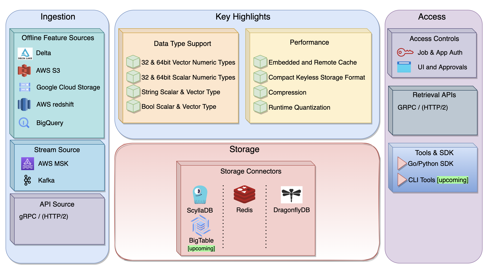

# Welcome to BharatMLStack's Online Feature Store Docs

Online Feature Store is a high-performance, scalable, and production-grade feature store built for modern machine learning systems. It supports both **real-time** and **batch** workflows, and is designed with a strong emphasis on **developer experience**, **system observability**, and **low-latency feature retrieval**.

---

## 📘 Documentation Index

### 🏗 Architecture
- [Online Feature Store – Production Architecture](./architecture.md)

### ⚙️ Core Components
- [Feature Generation](./architecture.md#feature-generation)
- [Kafka Streaming Ingestion](./architecture.md#kafka-layer-streaming-ingestion)
- [Horizon Control Plane](./architecture.md#horizon-configuration--control-plane)
- [Online Feature Store Consumer](./architecture.md#online-feature-store-consumer)
- [Online Feature Store gRPC API Server](./architecture.md#online-feature-store-grpc-api-server)
- [Monitoring & Observability](./architecture.md#monitoring--observability)

### 🧱 Low-Level Design
- [Permanent Storage Data Block (PSDB)](./psdb-design.md)
- [Cache Storage Data Block (CSDB)](./csdb-design.md)
- [DeserializedPSDB Structure](./ddb-design.md)
- [Key-Schema Isolation & etcd Mapping](./schema.md)

