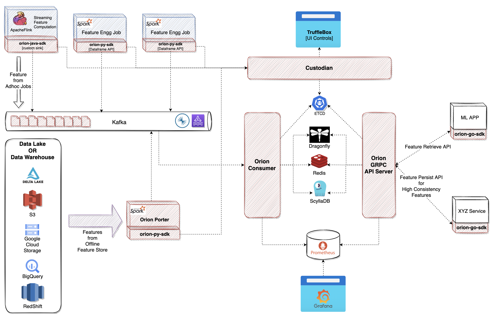

# BharatMLStack's Online-feature-store – Production Architecture

## Overview

BharatMLStack's Online-feature-store is a scalable, low-latency, and production-grade feature store that caters to both online machine learning workloads. The architecture is designed with **maintainability, scalability, and ease of integration** in mind. A core philosophy behind BharatMLStack's Online-feature-store is **not reinventing the wheel** — instead, it integrates seamlessly with existing infrastructure like Delta Lake, object stores, and data warehouses.

The system is optimized for both **Data Scientists and ML Engineers (MLEs)** by exposing intuitive SDKs and providing a consistent feature interface across batch and real-time use cases.

---

## Feature Generation

Most companies doing machine learning already store features in one of the following:
- **Delta Lake**, **Amazon S3**, **Google Cloud Storage (GCS)**,
- **BigQuery**, **Redshift**, or
- via existing offline feature store abstractions.

Online-feature-store supports both of the following ingestion paths:

### Ingestion from Existing Offline Sources
- `example/notebook` (a Spark-based utility) can be configured to **pull features** from pre-registered tables, files, or views.
- These features are pushed to **Kafka** (both managed and unmanaged topics supported), where the consumer layer will handle their eventual online ingestion.
- BharatMLStack's Online-feature-store supports ingestion from external batch sources such as:
  - **Delta Lake**
  - **Amazon S3**
  - **Google Cloud Storage**
  - **BigQuery**
  - **Redshift**

### Ingestion from Custom or New Feature Pipelines
- When no offline store abstraction exists or when building fresh pipelines, `python-sdk` can be directly injected into feature engineering jobs.
- These jobs (e.g. Spark pipelines) push features into Kafka after registering them with Online-feature-store.

This dual path has allows us to adopt BharatMLStack's Online-feature-store **without re-architecting existing pipelines**.

---

## Kafka Layer (Streaming Ingestion)

Kafka is used as a **buffered queue system** between feature producers and the Online-feature-store Consumer, which writes to the online store. This ensures:
- Decoupling between job execution and online database write speeds
- Fine-grained control over ingestion rate and storage load
- Ability to **scale consumers independently** from job producers
- Smooth integration with observability tooling

Kafka provides flexibility to handle spikes, manage backpressure, and offer replay capability during outages or re-deployments.

---

## Horizon (Configuration & Control Plane)

Horizon is the backend engine that powers **TruffleBox**, the UI control plane for managing feature metadata. It supports:

- **Entity**, **Feature Group**, and **Feature** registration workflows
- Assigning default values and setting TTLs
- Defining feature storage location (table/store ID), description, and types
- Generating proto schemas that power the gRPC API
- Storing operational config in **ETCD**

While TruffleBox UI and it's backend Horizon has its own operating manual, its core utility lies in enabling **feature discovery**, **cataloging**, and configuration — all from a no-code UI. It ensures that the BharatMLStack's ecosystem remains schema-consistent and easily operable across teams.

---

## Online Feature Store Consumer

The **Online Feature Store Consumer** is the ingestion workhorse responsible for:

- Reading feature messages from **Kafka**
- Validating schema compliance using **Protobufs**
- Performing **writes into online stores** based on registered feature group configurations
- Mapping incoming data to correct **storeIds** and internal data layouts

It supports writing to multiple storage backends:
- **Redis**: Ultra-low-latency retrievals for real-time use cases
- **Dragonfly**: High-performance in-memory DB for moderate consistency + speed
- **ScyllaDB**: Persistent, linearly scalable distributed database for high-throughput and durability

### Schema Versioning & Store Routing

A critical part of Online-Feature-Store Consumer's design is its ability to:
- **Identify the right schema version** at runtime based on feature metadata
- Use Horizon-generated mappings to **route feature data to correct store IDs**
- Serialize feature data into internally optimized layouts such as **PSDBBlocks** — an internal block-structured format for efficient reads/writes and compression

These mappings between feature groups and physical data storage layouts ensure optimal resource usage while maintaining high consistency and traceability. We'll deep-dive into the design of **PSDBBlocks**, sharding strategy, and serialization optimizations in the low-level design documentation.

### Scalability & Flow Control

This layer is horizontally scalable and can be tuned based on ingestion and storage pressure. Engineering teams can independently scale:
- **Producers** (e.g., Spark jobs writing to Kafka)
- **Consumers** (reading from Kafka and writing to stores)
- **Storage systems** (Redis, Dragonfly, ScyllaDB)

This separation of concerns ensures the platform remains stable even during load spikes, ingestion backpressure, or downstream outages.

---

## 5. Online Feature Store gRPC API Server

The **Online-Feature-Store gRPC API Server** exposes a unified and extensible interface for **real-time feature retrieval** and **high-consistency ingestion**. It serves as the primary point of interaction between ML applications and the feature store during inference and write-time operations.

### Responsibilities

- **Feature Retrieve API**  
  Used by ML apps and internal services via the `go-sdk`. It retrieves features by `entityId` or `composite key`, optimized for ultra-low-latency access.

- **Feature Persist API**  
  Called by backend services after key actions (e.g., user interactions) to store high-consistency features. It ensures schema enforcement and also **invalidates remote cache entries** to maintain strong consistency guarantees.

### Performance Optimizations & Internal Architecture

The gRPC server is designed for **high concurrency and low latency**, with several core optimizations:

#### 🧠 In-Memory LRU Caching
- Features are cached in an **in-memory LRU cache** to avoid repetitive reads from backends like Scylla or Redis.
- Cached responses are tied to entity key + feature group + version identifiers.
- Cache entries are **non-compressed** to allow faster reads.

#### 💾 Topology-Aware SSD Caching *(Planned)*
- A future extension introduces **topology-aware SSD-backed caches** for intermediate durability while keeping memory pressure low.
- This layer will store features in **CSDBBlocks** (compressed format), enabling fast ssd reads without overwhelming network or RAM.
- It will leverage NUMA-awareness and block-level caching for optimal performance.

#### 📦 CSDBBlocks (Cache-Storage Data Blocks)
- Feature values are serialized into **CSDBBlocks**, a structured, binary format optimized for:
  - Compression in remote cache (e.g., SSD or Redis/Dragonfly)
  - Fast decompression and memory layout for inference matrix assembly
- In-memory cache stores these blocks **uncompressed** to save CPU cycles on hot paths.

#### ⚙️ Channel-Based Parallelism (IPC)
- The internal execution pipeline uses **Go channels** for inter-goroutine communication.
- During high-volume reads:
  - Multiple goroutines independently fetch feature group data
  - A coordinating goroutine aggregates them into a **row-wise matrix**, suitable for model input
- This concurrent, non-blocking architecture drastically reduces tail latency.

### Integrations

- **Schema and Storage Metadata**: Pulled from **ETCD** at runtime for dynamic routing.
- **Stores**: Reads from Redis, Dragonfly, or ScyllaDB depending on feature group config and availability.
- **Protocol Buffers**: All payloads (incoming and outgoing) are validated against **compiled `.proto` definitions** for strict schema adherence.

### Additional Notes

- The **Persist API** ensures consistency by **removing stale keys from caches** post-write.
- The server is horizontally scalable and supports multi-tenancy if feature namespaces are used.
- A deep-dive on thread pools, block reuse, garbage collection handling, and dynamic batching is covered in the [Low-Level Design & Optimizations](#) section.

---

## 7. Monitoring & Observability

**Observability is a first-class concern** in Online-feature-store's architecture, enabling platform teams and MLEs to operate with confidence, debug with clarity, and scale with awareness.

### Current Monitoring Stack
- **Prometheus** scrapes detailed metrics from all Online-feature-store components including:
  - Kafka consumer lag
  - Ingestion and persist rates
  - Feature request latency (p99, p99.9, etc.)
  - Backend (Redis/Scylla) read/write IOPS
  - Cache hit/miss ratios and eviction stats
  - gRPC server health and method-level instrumentation

- **Grafana** dashboards are pre-configured for:
  - Live ingestion pipelines
  - Feature access latency and availability
  - System health
  - Cache hit ratios and memory usage
  - Default values counters

These dashboards are actively used by both **platform SREs** and **ML engineers** to debug issues, validate assumptions, and monitor ongoing experiments.

### Upcoming Capabilities
- **Feature Monitoring & Drift Detection** *(Planned)*:
  - Statistical monitoring of feature distributions (mean, stddev, cardinality, missing value rates)
  - Detection of concept drift and silent training-serving skew
  - Visualizations for drift timelines and automatic alerts for high-impact features

- **Alerting & Controls via TruffleBox**:
  - Upcoming TruffleBox integrations will allow users to:
    - Enable per-feature drift detection
    - Set alerting thresholds (e.g., feature null rate > 5%)
    - Subscribe to real-time alerts on Slack, PagerDuty, or email
    - Monitor model-feature dependency graphs for impact analysis
---

## 8. SDKs

Online-feature-store exposes SDKs for easy integration:
- `py-sdk`:
    - Used in Spark jobs
    - Powers `example/notebook`
    - Handles schema enforcement, and Kafka push
    - GRPC API for fast feature access
- `go-sdk`:
    - Lightweight gRPC client for backend services and ML inference time consumers

Both SDKs are well-documented, versioned, and compatible with TruffleBox-configured schemas.

---

## Key Highlights

- 🔁 **Hybrid Ingestion Support**  
  Seamlessly ingests both batch (offline) and real-time (streaming) features using `examples/notebook` and `sdks/python`.

- 🧠 **Smart Configuration Control via Horizon**  
  Centralized control plane (backed by ETCD) with TruffleBox UI for managing schemas, TTLs, store mappings, feature metadata, and default values.

- ⚙️ **Flexible and Tunable Ingestion Pipeline**  
  Kafka-based ingestion with pluggable consumer architecture allows ingestion and database write rates to scale independently.

- 🧩 **Store-Agnostic Design**  
  Supports Redis, Dragonfly, and ScyllaDB as pluggable backends depending on latency, consistency, and cost requirements.

- 💾 **Efficient Storage with PSDBBlocks and CSDBBlocks**  
  Internally optimized binary data blocks — compressed for remote storage, uncompressed in-memory — enable efficient reads/writes and future SSD cache integration.

- 🛠 **Channel-Based Concurrency**  
  Internal data flows are parallelized using Go routines and channels to build feature matrices in a lock-free, low-latency manner.

- 🚀 **Ultra-Low Latency Retrieval**  
  In-memory LRU caches and SSD-based caching plans ensure sub-ms retrievals for hot paths.

- 📊 **Comprehensive Observability**  
  Integrated with Prometheus and Grafana, offering deep visibility into ingestion health, request latencies, feature usage patterns, and system performance.

- 📉 **Future-Ready Feature Drift Monitoring**  
  Built-in support (planned) for monitoring feature statistics, detecting drift, and surfacing alerts — configurable directly from TruffleBox.

- 🧪 **Developer-Centric SDKs**  
  Python and Go SDKs offer intuitive APIs for registration, ingestion, and retrieval — designed for Data Scientists, ML Engineers, and backend developers.

- 🌐 **gRPC + Protobuf APIs**  
  Strongly typed, high-performance APIs for online access and ingestion with strict schema validation and versioning.

- 🏗 **Modular and Extensible Architecture**  
  Every layer — from ingestion to cache to storage — is designed to be replaced or extended, enabling future integrations with new stores or transport layers.
---

