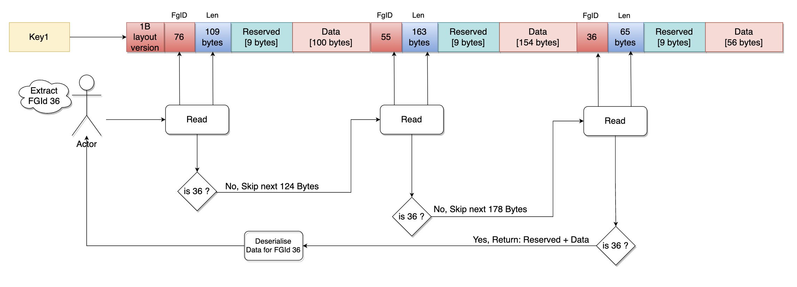

# Cache Storage Data Block (CSDB) Design

## Overview
The Cache Storage Data Block (CSDB) is a compact binary data format that encapsulates serialized data blocks for multiple feature groups. It is designed to support both in-memory and distributed caching of deserialized PSDB (Permanent Storage Data Block) content, optimizing for speed, deduplication, and minimal memory overhead.

## Structure and Purpose
Each CSDB contains a mapping of feature group IDs (FG IDs) to deserialized PSDBs. For distributed systems, this structure is flattened into a serialized byte slice. The CSDB supports layout versioning for backward compatibility and negative caching for feature groups with no associated data.

### Core Fields and Memory Layout
```go
type CacheStorageDataBlock struct {
    // 8-byte aligned map pointer
    FGIdToDDB map[int]*DeserializedPSDB // offset: 0

    // 24-byte slice (ptr, len, cap)
    serializedCSDB []byte // offset: 8

    // 4-byte fields
    TTL uint32 // offset: 32

    // 1-byte fields
    layoutVersion uint8     // offset: 36
    cacheType     CacheType // offset: 37
    // 2 bytes padding to maintain 4-byte alignment
}
```
The structure is memory-aligned for optimal performance:
- Pointers and slices are 8-byte aligned
- Smaller fields (like `uint8`) are grouped and padded to avoid false sharing
- This layout ensures efficient use of CPU caches during access

### Cache Types
- **In-Memory Cache**: Uses the `FGIdToDDB` map directly and avoids serialization unless explicitly requested.
- **Distributed Cache**: Stores a serialized binary format in `serializedCSDB`, which is deserialized lazily when required.

## Format & Encoding

### CSDB Binary Layout
Serialized CSDBs follow this compact format:

```
[LayoutVersion (1 byte)][FGID (2 bytes)][DataLen (2 bytes)][Data ...]   → repeated per feature group
```
- FGID and DataLen are encoded as `uint16`
- If `DataLen == 0`, it denotes a negative cache (no data available for that FG)
- The data section contains the PSDB header and either compressed or uncompressed data

This layout allows fast scanning and partial deserialization for selected FG IDs, making it optimal for large-scale caching systems.

## Differences Between In-Memory and Distributed Caching

| Aspect            | In-Memory CSDB                          | Distributed CSDB                          |
|------------------|-----------------------------------------|-------------------------------------------|
| Storage Format   | Live Go objects (map[int]*DeserializedPSDB) | Serialized byte buffer (`[]byte`)        |
| Deserialization  | Performed on-demand using offset map    | Performed on-demand using offset map      |
| Compression      | Optional during serialization           | Typically enabled to reduce payload size  |
| Usage Pattern    | Fast lookup in active process memory    | Cross-node cache sharing and persistence  |
| Memory Overhead  | Higher (due to live objects)            | Lower (compact representation)            |

## Optimizations & Features

- **Partial FG ID Fetch**: When only a subset of FG IDs is needed, CSDB avoids unnecessary deserialization of other IDs.
- **Negative Caching**: FG IDs with no data are encoded with `DataLen=0`, saving space and avoiding repeated lookups.
- **Offset-Length Map**: During deserialization, FGID to offset+length pairs are cached internally for efficient random access.
- **Versioning Support**: Layout version is stored as the first byte to enable format upgrades while maintaining backward compatibility.

Diagram below explains how compute cycles are saved by partial de-compression. 



## Summary
The CSDB is a performant and extensible data block format for caching PSDBs. Its dual-mode (in-memory and distributed) design allows it to be used flexibly in different deployment environments. The binary layout ensures minimal overhead for storage and fast lookups by FG ID. Combined with compression and negative caching, CSDB enables scalable caching of feature group data across services and systems.

