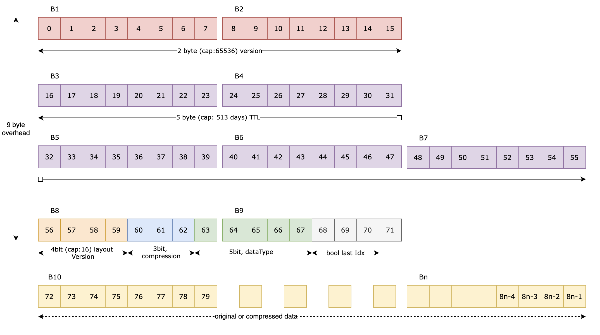

# Permanent Storage Data Block (PSDB) Design

## Overview
The Permanent Storage Data Block (PSDB) is a low-level, performance-oriented data format designed for compact, efficient serialization and storage of various data types. It supports advanced features such as vector types, string encoding, and bit-packing of booleans, along with optional compression. 

## Data Structure Layout

### PSDB Header (9 bytes)

The PSDB header occupies 9 bytes and encodes key metadata fields using bit-level packing for space efficiency.

| Byte | Bits        | Field                  | Description                                                                 |
|------|-------------|------------------------|-----------------------------------------------------------------------------|
| 0-1  | 0-15        | Feature Schema Version | Version for tracking schema changes (additions/deletions) in feature group |
| 2-6  | 16-55       | Expiry Timestamp       | Encoded as a compact representation                                        |
| 7    | 56-59       | Layout Version         | Used to ensure backward compatibility with layout format changes           |
| 7    | 60-62       | Compression Type       | 3-bit field specifying compression algorithm                               |
| 7-8  | 63-67       | Data Type              | 5-bit field split across bytes 7 and 8                                     |
| 8    | 68-71       | Bool Last Valid Bit    | 4-bit field for last valid boolean bit                                     |

> **Note**: All multi-byte fields follow system-specific byte order.

## Core Components

```go
type PermStorageDataBlock struct {
    expiryAt       uint64
    Data           interface{}
    buf            []byte
    originalData   []byte
    compressedData []byte
    stringLengths  []uint16
    vectorLengths  []uint16
    Builder        *PermStorageDataBlockBuilder

    noOfFeatures      int
    originalDataLen   int
    compressedDataLen int

    featureSchemaVersion uint16  // Tracks changes in feature group schema

    layoutVersion    uint8       // Determines PSDB layout for backward compatibility
    compressionType  compression.Type
    dataType         types.DataType
    boolDtypeLastIdx uint8
}
```

## Supported Data Types

### Scalar Types
- Floating Point: FP64, FP32, FP16, FP8E4M3, FP8E5M2 (received as FP32 containers)
- Integer: Int64, Int32, Int16, Int8 (received as Int32 containers)
- Unsigned Integer: Uint64, Uint32, Uint16, Uint8 (received as Uint32 containers)
- Boolean: Received as Uint8
- String

### Vector Types
- All scalar types support vector variants (e.g., [][]float32)
- String Vectors and Boolean Vectors have special handling

## Serialization Strategy

### Strings (Pascal Encoding)
```text
[len1][len2]...[lenN][str1][str2]...[strN]
```
- Each length prefix is a uint16 (2 bytes)
- Strings are encoded as raw byte arrays following length prefixes
- Max length: 65535 bytes

### Booleans (Bit-Packed)
- 8 booleans per byte
- The final byte may be partially filled; `boolDtypeLastIdx` tracks the last valid bit

### Vectors
- Vectors are flattened into a contiguous byte buffer
- Lengths of each sub-array are tracked in `vectorLengths`
- String vectors track both `vectorLengths` and `stringLengths`

## Compression Workflow

1. Data is serialized into `originalData`
2. Compressed using the specified encoder
3. If compression is ineffective:
   - Use original data
   - Compression type set to `None`
4. If compression is effective:
   - Use compressed data
   - Set compression type accordingly

### Compression Type Encoding
Stored in bits 60-62 of byte 7:
```go
header[7] = (header[7] & 0xF1) | ((compressionType & 0x07) << 1)
```

## Memory and Alignment

- Fields are ordered for 64-bit alignment and cache efficiency
- Buffers (`buf`, `originalData`, `compressedData`) are reused to reduce allocations
- `Clear()` resets the structure for reuse

## Error Handling

Robust error checks are included for:
- Buffer size mismatches
- Data type or container inconsistencies
- Length overflows in string/vector types
- Compression failures

## Performance Considerations

- **Byte Order**: Consistent use of system byte order ensures compatibility
- **Memory Reuse**: Buffers are trimmed and reused when possible
- **Compression Optimization**: Skips compression if it doesn’t yield space savings
- **Serialization Dispatch**: Uses `Serialize()` method to select layout version and invoke the appropriate handler

---

This document outlines the key design aspects of the PSDB structure and its associated serialization mechanisms. The implementation ensures compactness, extensibility, and high-performance data handling suitable for low-level, high-throughput systems.

