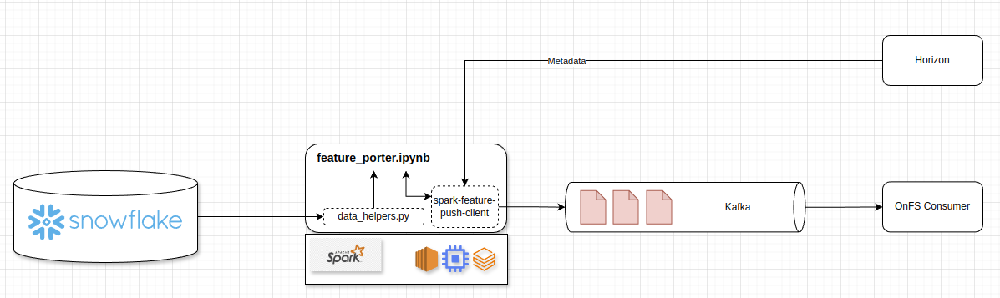

# RFC00001: Snowflake Feature Pull Connector for BharatMLStack

## Metadata
- **Author:** Adarsha Das
- **Date Created:** 2025-07-05
- **Status:** Draft
- **Target Release:** v1.1.0
- **Discussion Channel:** #connectors-snowflake

---

## 1. Summary
This proposal introduces native support for **Snowflake** as an offline feature store **and** describes an end-to-end pipeline that ports those features into **BharatMLStack's online feature store** so they can be served for real-time inference. The connector retrieves features from Snowflake using the `snowflake.ml.feature_store` API, applies the transformation/deduplication logic in `data_helpers.py`, then relies on `spark_feature_push_client` to serialize the resulting Spark DataFrame into Protobuf and push it—via Kafka or another configured sink—into the online store. The aim is to provide a single, frictionless path from Snowflake to online serving with zero intermediate exports.

## 2. Motivation
1. **Industry Adoption** – Snowflake is the de-facto cloud data warehouse for many ML teams.
2. **Unified Governance** – Keeping features in Snowflake allows teams to reuse established data contracts, lineage, and RBAC.
3. **Performance & Scale** – Snowflake's automatic scaling matches BharatMLStack's design philosophy of elastic cost.
4. **Developer Ergonomics** – The `snowflake.ml.feature_store` SDK abstracts low-level SQL and improves developer productivity.

Without this connector, users have to export data to object storage before ingesting it, introducing latency and operational overhead.

## 3. Goals
- Add **`SNOWFLAKE_TABLE`** as a new `source_type` value consumed by `read_from_source()`.
- Use the **`snowflake.ml.feature_store.FeatureStore`** abstraction for reading data, not raw JDBC.
- Support predicate-pushdown on a configurable partition column (default: `ingestion_timestamp`).
- Preserve existing semantics: the helper must return a Spark DataFrame deduplicated on entity keys.
- Provide clear configuration & credential management guidelines.
- Seamlessly push the transformed Snowflake features to BharatMLStack's online feature store through `spark_feature_push_client`, enabling immediate consumption at inference time.

## 4. Non-Goals
- Online serving from Snowflake (future work).
- Bi-directional sync or writing features back into Snowflake.
- Support for Snowflake external tables or stages (out of scope for first version).

## 5. Detailed Design

### 5.1 Data Pull Flow
1. **Session Creation** – A `snowpark.Session` is established using env-vars or a passed-in config map.
2. **Feature Store Bind** – Instantiate `FeatureStore(session)`.
3. **Table Selection** – Retrieve the maximum value of the partition column via the Feature Store API.
4. **Data Retrieval** – Load the filtered rows into a Spark DataFrame through `feature_store.read().to_spark()`.
5. **Schema Alignment** – Column names are normalized and optionally renamed according to `feature_mapping`.

### 5.2 Data Push Flow
1. **Null Handling & Default Filling** – Invoke `fill_na_features_with_default_values` to replace missing values based on feature metadata.
2. **Proto Generation** – Use `OnlineFeatureStorePyClient.generate_df_with_protobuf_messages` (from `spark_feature_push_client`) to convert rows into Protobuf messages.
3. **Batching & Kafka Write** – Call `write_protobuf_df_to_kafka`, optionally in batches, to stream messages to the online feature-store ingress topic.
4. **Audit Sink (Optional)** – If `features_write_to_cloud_storage` is `true`, persist the transformed DataFrame to the configured cloud path for replay or debugging.
5. **Online Availability** – Once consumed by BharatMLStack's ingestion service, features become queryable for real-time inference within SLA (p95 < X s).

### 5.3 API Touch-Points
| Function | Change | Rationale |
| --- | --- | --- |
| `read_from_source()` | Add `elif source_type == "SNOWFLAKE_TABLE"` branch to perform steps in 5.1 | Aligns with existing connector pattern |
| `src_type_to_partition_col_map` | Append `"SNOWFLAKE_TABLE": "ingestion_timestamp"` | Ensures incremental loads |

### 5.4 Configuration
| Parameter | Description | Example |
| --- | --- | --- |
| `SNOWFLAKE_ACCOUNT` | Snowflake account identifier | `xy12345.us-east-1` |
| `SNOWFLAKE_USER` | Login user | `ml_readonly` |
| `SNOWFLAKE_PASSWORD` | Password or OAuth token | `****` |
| `SNOWFLAKE_WAREHOUSE` | Virtual warehouse used for queries | `ML_WH` |
| `SNOWFLAKE_DATABASE` | Database containing feature tables | `FEATURE_DB` |
| `SNOWFLAKE_SCHEMA` | Default schema | `PUBLIC` |

Credentials are loaded by helper utilities and injected into the Snowpark session. Users may override through function arguments for multi-account scenarios.

### 5.5 Error Handling & Observability
- **Retry Logic:** Exponential backoff for transient Snowflake errors (`XYZ-0001`, `XYZ-0002`).
- **Metrics:**
  - `snowflake.connector.latency_ms`
  - `snowflake.connector.rows_read`
  - `snowflake.connector.bytes_scanned`
- **Logging:** Obfuscate sensitive parameters before logging connection strings.

## 6. Test Plan
1. **Unit Tests** – Mock `snowflake.ml.feature_store` to simulate data fetches.
2. **Integration Tests** – Use Snowflake's `TPCH_SF1` sample to validate partition filtering, column renaming, null-handling, Protobuf generation, and successful push to the online feature store.
3. **Schema Drift Tests** – Verify connector surface errors when expected columns are missing or types change.

## 7. Rollout Strategy
| Phase | Description |
| --- | --- |
| Alpha | Flag-guarded release for internal users. Collect feedback. |
| Beta | Publicly documented. Backwards compatibility guaranteed. |
| GA | Remove feature flag. Add SLA monitoring. |

## 8. Alternatives Considered
- **Spark JDBC Connector** – Simpler, but lacks feature-store metadata awareness and type mapping.
- **Materializing Views to Parquet** – Adds latency and duplication of storage.

## 9. Risks & Mitigations
| Risk | Impact | Mitigation |
| --- | --- | --- |
| Snowflake API instability | Ingest failures | Pin to major version; add compatibility tests |
| Credential leakage | Security breach | Use secrets manager integration; no plaintext logs |
| Large data pulls | Cost overruns | Enforce partition filters; sample row counts during CI |

## 10. Success Metrics
- 100% schema parity with Snowflake source tables.

## 11. Future Work
- Automatic statistics push to BharatML observability dashboard.

## 12. References
- Snowflake ML Feature Store Documentation (2024-04) — *"snowflake.ml.feature_store"*.

